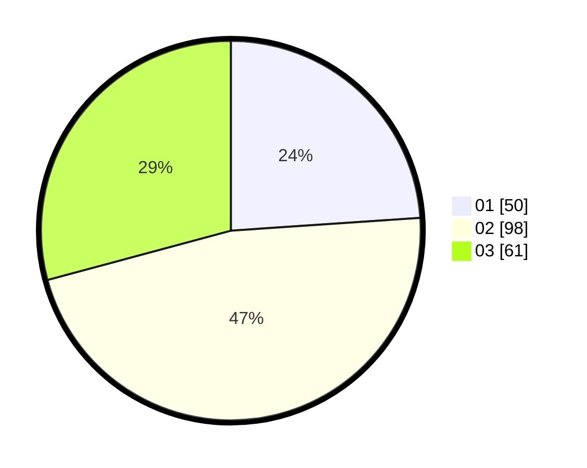

# Hasil

Hasil perolehan suara paslon dapat dilihat pada file paslon-01.txt, paslon-02.txt, dan paslon-03.txt.

Jika tidak ada, artinya data tersebut belum ada pada SIREKAP.

## Perolehan Suara

 * Paslon 01: **50**.
 * Paslon 02: **98**.
 * Paslon 03: **61**.

## Foto C Plano

https://sirekap-obj-formc.kpu.go.id/d23d/pemilu/ppwp/31/73/01/10/04/3173011004043-20240214-201707--ce96b20e-8b48-4f4c-b161-49ffa28e2ae2.jpg

https://sirekap-obj-formc.kpu.go.id/d23d/pemilu/ppwp/31/73/01/10/04/3173011004043-20240216-090130--d22b2d10-638c-4119-b4c3-1d0b28c5b821.jpg

https://sirekap-obj-formc.kpu.go.id/d23d/pemilu/ppwp/31/73/01/10/04/3173011004043-20240214-201938--4e951c8b-7bae-458b-bfc7-0ee39ca9f729.jpg

## DATA PEMILIH TETAP

Jumlah pemilih dalam DPT: **293**.
 * L: **153**.
 * P: **140**.

## DATA PENGGUNA HAK PILIH

Jumlah pengguna hak pilih dalam DPT: **210**.
 * L: **112**.
 * P: **98**.

Jumlah pengguna hak pilih dalam DPTb: **2**.
 * L: **1**.
 * P: **1**.

Jumlah pengguna hak pilih dalam DPK: **1**.
 * L: **0**.
 * P: **1**.

Jumlah pengguna hak pilih: **213**.
 * L: **113**.
 * P: **100**.

## JUMLAH SUARA SAH DAN TIDAK SAH

JUMLAH SELURUH SUARA SAH: **209**.

JUMLAH SUARA TIDAK SAH: **4**.

JUMLAH SELURUH SUARA SAH DAN SUARA TIDAK SAH: **213**.
