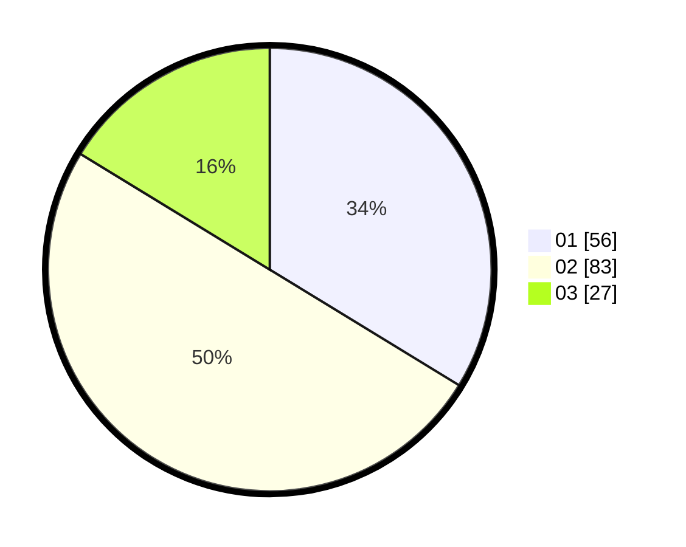

# Hasil

Hasil perolehan suara paslon dapat dilihat pada file paslon-01.txt, paslon-02.txt, dan paslon-03.txt.

Jika tidak ada, artinya data tersebut belum ada pada SIREKAP.

## Perolehan Suara

 * Paslon 01: **56**.
 * Paslon 02: **83**.
 * Paslon 03: **27**.

## Foto C Plano

https://sirekap-obj-formc.kpu.go.id/e120/pemilu/ppwp/31/73/01/10/04/3173011004046-20240216-023558--98a0c7a5-e4fc-4371-a5db-503cc7dd80fa.jpg

https://sirekap-obj-formc.kpu.go.id/e120/pemilu/ppwp/31/73/01/10/04/3173011004046-20240216-023610--f40779da-b5dc-4bd7-91bf-349ba7b7ee4c.jpg

https://sirekap-obj-formc.kpu.go.id/e120/pemilu/ppwp/31/73/01/10/04/3173011004046-20240216-023603--79a1e343-e489-4a01-8b31-094275318a63.jpg

## DATA PEMILIH TETAP

Jumlah pemilih dalam DPT: **229**.
 * L: **115**.
 * P: **114**.

## DATA PENGGUNA HAK PILIH

Jumlah pengguna hak pilih dalam DPT: **167**.
 * L: **83**.
 * P: **84**.

Jumlah pengguna hak pilih dalam DPTb: **3**.
 * L: **1**.
 * P: **2**.

Jumlah pengguna hak pilih dalam DPK: **0**.
 * L: **0**.
 * P: **0**.

Jumlah pengguna hak pilih: **170**.
 * L: **84**.
 * P: **86**.

## JUMLAH SUARA SAH DAN TIDAK SAH

JUMLAH SELURUH SUARA SAH: **166**.

JUMLAH SUARA TIDAK SAH: **4**.

JUMLAH SELURUH SUARA SAH DAN SUARA TIDAK SAH: **170**.
