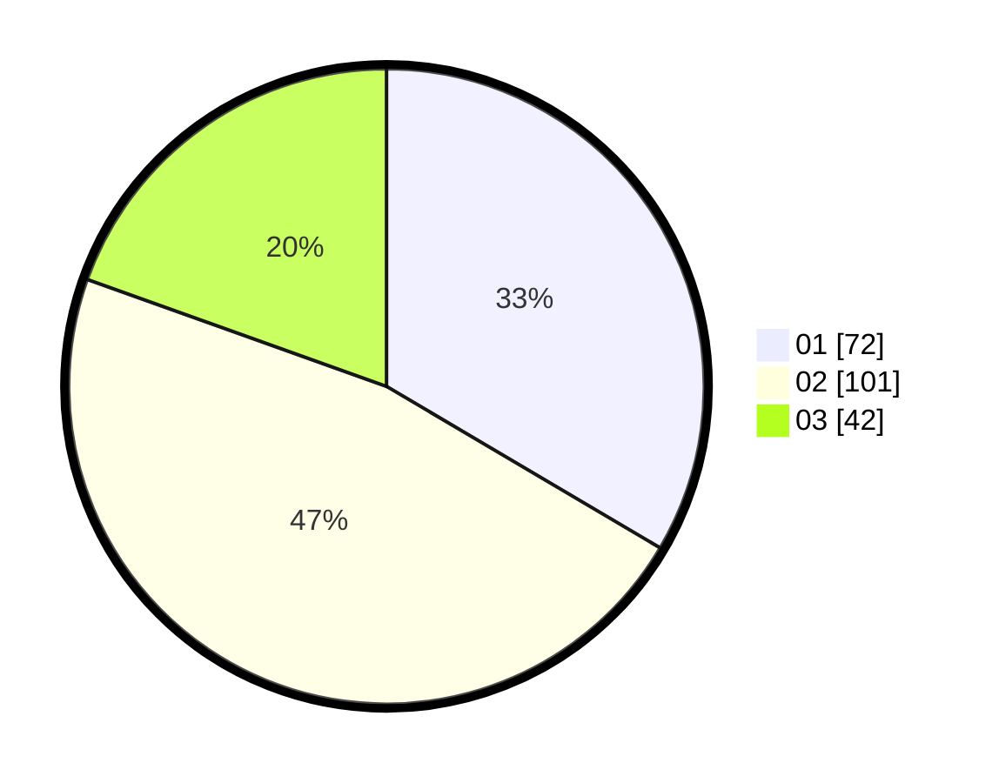

# Hasil

Hasil perolehan suara paslon dapat dilihat pada file paslon-01.txt, paslon-02.txt, dan paslon-03.txt.

Jika tidak ada, artinya data tersebut belum ada pada SIREKAP.

## Perolehan Suara

 * Paslon 01: **72**.
 * Paslon 02: **101**.
 * Paslon 03: **42**.

## Foto C Plano

https://sirekap-obj-formc.kpu.go.id/4c14/pemilu/ppwp/31/73/01/10/04/3173011004047-20240216-004332--74493e07-9165-4e1a-a458-a3d30b7466bf.jpg

https://sirekap-obj-formc.kpu.go.id/4c14/pemilu/ppwp/31/73/01/10/04/3173011004047-20240216-004333--d06ed5d9-9f49-4542-a3f0-bf0dfc462ecd.jpg

https://sirekap-obj-formc.kpu.go.id/4c14/pemilu/ppwp/31/73/01/10/04/3173011004047-20240216-004333--7be12cad-4a63-48c6-ac2a-00da5f364838.jpg

## DATA PEMILIH TETAP

Jumlah pemilih dalam DPT: **258**.
 * L: **132**.
 * P: **126**.

## DATA PENGGUNA HAK PILIH

Jumlah pengguna hak pilih dalam DPT: **214**.
 * L: **104**.
 * P: **110**.

Jumlah pengguna hak pilih dalam DPTb: **3**.
 * L: **2**.
 * P: **1**.

Jumlah pengguna hak pilih dalam DPK: **0**.
 * L: **0**.
 * P: **0**.

Jumlah pengguna hak pilih: **217**.
 * L: **106**.
 * P: **111**.

## JUMLAH SUARA SAH DAN TIDAK SAH

JUMLAH SELURUH SUARA SAH: **215**.

JUMLAH SUARA TIDAK SAH: **2**.

JUMLAH SELURUH SUARA SAH DAN SUARA TIDAK SAH: **217**.
