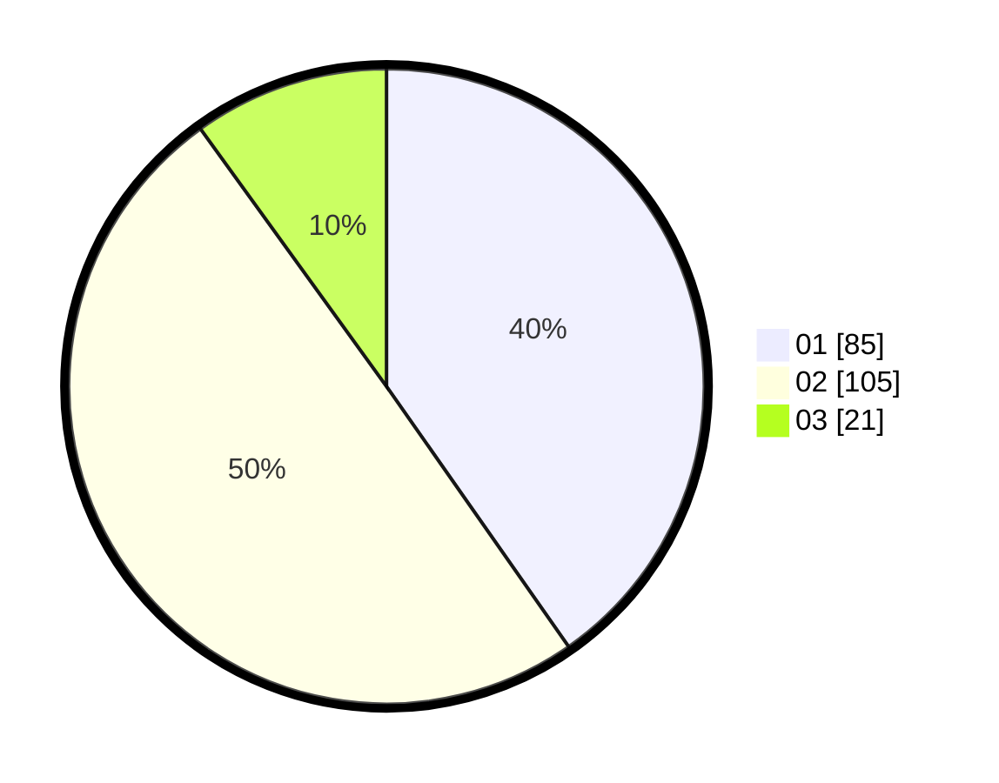

# Hasil

Hasil perolehan suara paslon dapat dilihat pada file paslon-01.txt, paslon-02.txt, dan paslon-03.txt.

Jika tidak ada, artinya data tersebut belum ada pada SIREKAP.

## Perolehan Suara

 * Paslon 01: **85**.
 * Paslon 02: **105**.
 * Paslon 03: **21**.

## Foto C Plano

https://sirekap-obj-formc.kpu.go.id/517a/pemilu/ppwp/31/73/01/10/04/3173011004049-20240214-185841--9aacbc9e-a3e5-4020-ba79-211d0cfdfebc.jpg

https://sirekap-obj-formc.kpu.go.id/517a/pemilu/ppwp/31/73/01/10/04/3173011004049-20240214-194117--04424b12-c107-479f-a8b1-a4296b134613.jpg

https://sirekap-obj-formc.kpu.go.id/517a/pemilu/ppwp/31/73/01/10/04/3173011004049-20240214-191323--6e1f04fd-4b49-47ca-a9f2-631685dfa2bf.jpg

## DATA PEMILIH TETAP

Jumlah pemilih dalam DPT: **282**.
 * L: **143**.
 * P: **139**.

## DATA PENGGUNA HAK PILIH

Jumlah pengguna hak pilih dalam DPT: **210**.
 * L: **99**.
 * P: **111**.

Jumlah pengguna hak pilih dalam DPTb: **3**.
 * L: **2**.
 * P: **1**.

Jumlah pengguna hak pilih dalam DPK: **2**.
 * L: **1**.
 * P: **1**.

Jumlah pengguna hak pilih: **215**.
 * L: **102**.
 * P: **113**.

## JUMLAH SUARA SAH DAN TIDAK SAH

JUMLAH SELURUH SUARA SAH: **211**.

JUMLAH SUARA TIDAK SAH: **4**.

JUMLAH SELURUH SUARA SAH DAN SUARA TIDAK SAH: **215**.
