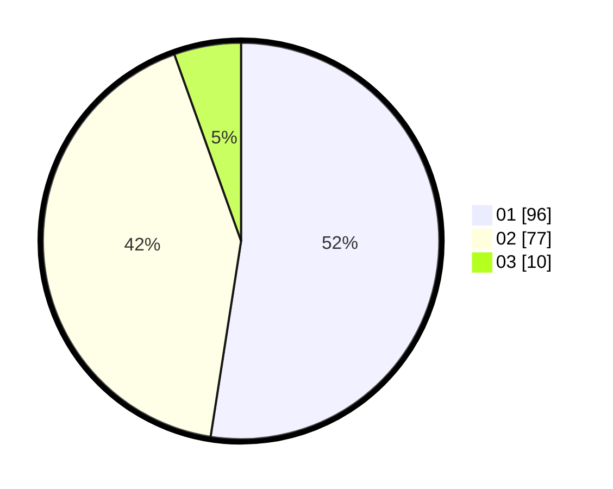

# Hasil

Hasil perolehan suara paslon dapat dilihat pada file paslon-01.txt, paslon-02.txt, dan paslon-03.txt.

Jika tidak ada, artinya data tersebut belum ada pada SIREKAP.

## Perolehan Suara

 * Paslon 01: **96**.
 * Paslon 02: **77**.
 * Paslon 03: **10**.

## Foto C Plano

https://sirekap-obj-formc.kpu.go.id/23a8/pemilu/ppwp/31/73/01/10/04/3173011004053-20240214-155830--97a63465-c7d1-43e8-8777-747e6c51acf1.jpg

https://sirekap-obj-formc.kpu.go.id/23a8/pemilu/ppwp/31/73/01/10/04/3173011004053-20240214-160123--5c946774-d47b-45ea-b462-a95b1def8b49.jpg

https://sirekap-obj-formc.kpu.go.id/23a8/pemilu/ppwp/31/73/01/10/04/3173011004053-20240214-160121--f27f44ef-27d8-4c4e-b9eb-4257797347e2.jpg

## DATA PEMILIH TETAP

Jumlah pemilih dalam DPT: **252**.
 * L: **126**.
 * P: **126**.

## DATA PENGGUNA HAK PILIH

Jumlah pengguna hak pilih dalam DPT: **183**.
 * L: **92**.
 * P: **91**.

Jumlah pengguna hak pilih dalam DPTb: **0**.
 * L: **0**.
 * P: **0**.

Jumlah pengguna hak pilih dalam DPK: **0**.
 * L: **0**.
 * P: **0**.

Jumlah pengguna hak pilih: **183**.
 * L: **92**.
 * P: **91**.

## JUMLAH SUARA SAH DAN TIDAK SAH

JUMLAH SELURUH SUARA SAH: **183**.

JUMLAH SUARA TIDAK SAH: **0**.

JUMLAH SELURUH SUARA SAH DAN SUARA TIDAK SAH: **183**.
