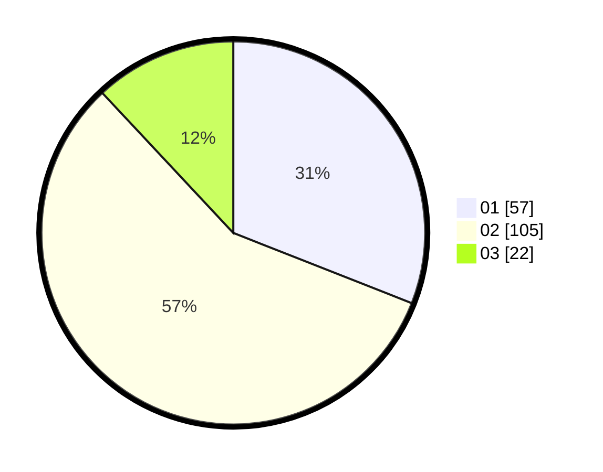

# Hasil

Hasil perolehan suara paslon dapat dilihat pada file paslon-01.txt, paslon-02.txt, dan paslon-03.txt.

Jika tidak ada, artinya data tersebut belum ada pada SIREKAP.

## Perolehan Suara

 * Paslon 01: **57**.
 * Paslon 02: **105**.
 * Paslon 03: **22**.

## Foto C Plano

https://sirekap-obj-formc.kpu.go.id/6a6b/pemilu/ppwp/31/73/01/10/04/3173011004062-20240215-234329--aac7ad59-a2be-43bd-bb71-306f3786b1f3.jpg

https://sirekap-obj-formc.kpu.go.id/6a6b/pemilu/ppwp/31/73/01/10/04/3173011004062-20240215-234331--0a383a6a-a69e-4225-b45d-15c2bd111e97.jpg

https://sirekap-obj-formc.kpu.go.id/6a6b/pemilu/ppwp/31/73/01/10/04/3173011004062-20240215-234330--7ee8ea3d-69ec-413a-8c28-8cbc29736a44.jpg

## DATA PEMILIH TETAP

Jumlah pemilih dalam DPT: **0**.
 * L: **0**.
 * P: **0**.

## DATA PENGGUNA HAK PILIH

Jumlah pengguna hak pilih dalam DPT: **0**.
 * L: **0**.
 * P: **0**.

Jumlah pengguna hak pilih dalam DPTb: **0**.
 * L: **0**.
 * P: **0**.

Jumlah pengguna hak pilih dalam DPK: **0**.
 * L: **0**.
 * P: **0**.

Jumlah pengguna hak pilih: **0**.
 * L: **0**.
 * P: **0**.

## JUMLAH SUARA SAH DAN TIDAK SAH

JUMLAH SELURUH SUARA SAH: **184**.

JUMLAH SUARA TIDAK SAH: **2**.

JUMLAH SELURUH SUARA SAH DAN SUARA TIDAK SAH: **186**.
