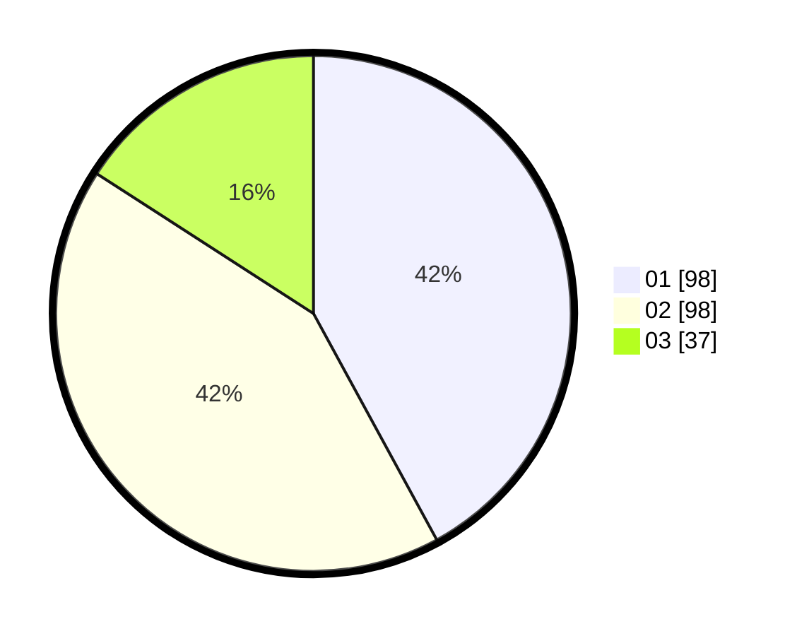

# Hasil

Hasil perolehan suara paslon dapat dilihat pada file paslon-01.txt, paslon-02.txt, dan paslon-03.txt.

Jika tidak ada, artinya data tersebut belum ada pada SIREKAP.

## Perolehan Suara

 * Paslon 01: **98**.
 * Paslon 02: **98**.
 * Paslon 03: **37**.

## Foto C Plano

https://sirekap-obj-formc.kpu.go.id/9af8/pemilu/ppwp/31/73/01/10/04/3173011004064-20240215-232513--d6ff7aeb-1350-4b1f-8f4b-4a6f1b635663.jpg

https://sirekap-obj-formc.kpu.go.id/9af8/pemilu/ppwp/31/73/01/10/04/3173011004064-20240215-232515--2883556f-1bf0-405f-bea8-8853adff6872.jpg

https://sirekap-obj-formc.kpu.go.id/9af8/pemilu/ppwp/31/73/01/10/04/3173011004064-20240215-232514--98eb1fee-ed70-4f4b-ae17-285a75e0b993.jpg

## DATA PEMILIH TETAP

Jumlah pemilih dalam DPT: **292**.
 * L: **156**.
 * P: **136**.

## DATA PENGGUNA HAK PILIH

Jumlah pengguna hak pilih dalam DPT: **235**.
 * L: **122**.
 * P: **113**.

Jumlah pengguna hak pilih dalam DPTb: **0**.
 * L: **0**.
 * P: **0**.

Jumlah pengguna hak pilih dalam DPK: **4**.
 * L: **2**.
 * P: **2**.

Jumlah pengguna hak pilih: **239**.
 * L: **124**.
 * P: **115**.

## JUMLAH SUARA SAH DAN TIDAK SAH

JUMLAH SELURUH SUARA SAH: **233**.

JUMLAH SUARA TIDAK SAH: **6**.

JUMLAH SELURUH SUARA SAH DAN SUARA TIDAK SAH: **239**.
