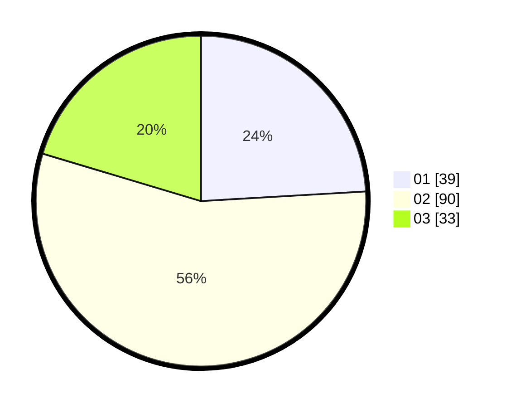

# Hasil

Hasil perolehan suara paslon dapat dilihat pada file paslon-01.txt, paslon-02.txt, dan paslon-03.txt.

Jika tidak ada, artinya data tersebut belum ada pada SIREKAP.

## Perolehan Suara

 * Paslon 01: **39**.
 * Paslon 02: **90**.
 * Paslon 03: **33**.

## Foto C Plano

https://sirekap-obj-formc.kpu.go.id/24aa/pemilu/ppwp/31/73/01/10/04/3173011004073-20240214-215135--541474a7-cb51-4e15-9d25-479e759c6ddd.jpg

https://sirekap-obj-formc.kpu.go.id/24aa/pemilu/ppwp/31/73/01/10/04/3173011004073-20240214-215156--52afb9b7-8c63-4196-9474-875aa065ef74.jpg

https://sirekap-obj-formc.kpu.go.id/24aa/pemilu/ppwp/31/73/01/10/04/3173011004073-20240214-215146--b36150f2-b96c-42fe-a329-e09adb37c01b.jpg

## DATA PEMILIH TETAP

Jumlah pemilih dalam DPT: **216**.
 * L: **97**.
 * P: **119**.

## DATA PENGGUNA HAK PILIH

Jumlah pengguna hak pilih dalam DPT: **164**.
 * L: **70**.
 * P: **94**.

Jumlah pengguna hak pilih dalam DPTb: **0**.
 * L: **0**.
 * P: **0**.

Jumlah pengguna hak pilih dalam DPK: **0**.
 * L: **0**.
 * P: **0**.

Jumlah pengguna hak pilih: **164**.
 * L: **70**.
 * P: **94**.

## JUMLAH SUARA SAH DAN TIDAK SAH

JUMLAH SELURUH SUARA SAH: **162**.

JUMLAH SUARA TIDAK SAH: **2**.

JUMLAH SELURUH SUARA SAH DAN SUARA TIDAK SAH: **164**.
