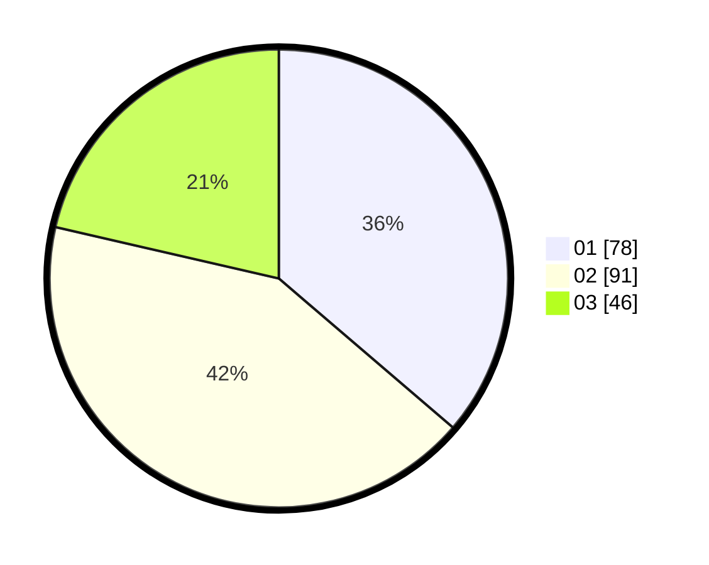

# Hasil

Hasil perolehan suara paslon dapat dilihat pada file paslon-01.txt, paslon-02.txt, dan paslon-03.txt.

Jika tidak ada, artinya data tersebut belum ada pada SIREKAP.

## Perolehan Suara

 * Paslon 01: **78**.
 * Paslon 02: **91**.
 * Paslon 03: **46**.

## Foto C Plano

https://sirekap-obj-formc.kpu.go.id/a7e5/pemilu/ppwp/31/73/01/10/04/3173011004075-20240214-230254--2e0ac91b-1343-499e-86e7-4864fddc34b6.jpg

https://sirekap-obj-formc.kpu.go.id/a7e5/pemilu/ppwp/31/73/01/10/04/3173011004075-20240214-230135--e5cb8c54-9a80-44c8-a058-f1245a3f2b40.jpg

https://sirekap-obj-formc.kpu.go.id/a7e5/pemilu/ppwp/31/73/01/10/04/3173011004075-20240214-230044--743ab583-5b90-4464-8579-b03c30e983a5.jpg

## DATA PEMILIH TETAP

Jumlah pemilih dalam DPT: **271**.
 * L: **140**.
 * P: **131**.

## DATA PENGGUNA HAK PILIH

Jumlah pengguna hak pilih dalam DPT: **216**.
 * L: **110**.
 * P: **106**.

Jumlah pengguna hak pilih dalam DPTb: **1**.
 * L: **0**.
 * P: **1**.

Jumlah pengguna hak pilih dalam DPK: **1**.
 * L: **1**.
 * P: **0**.

Jumlah pengguna hak pilih: **218**.
 * L: **111**.
 * P: **107**.

## JUMLAH SUARA SAH DAN TIDAK SAH

JUMLAH SELURUH SUARA SAH: **215**.

JUMLAH SUARA TIDAK SAH: **3**.

JUMLAH SELURUH SUARA SAH DAN SUARA TIDAK SAH: **218**.
