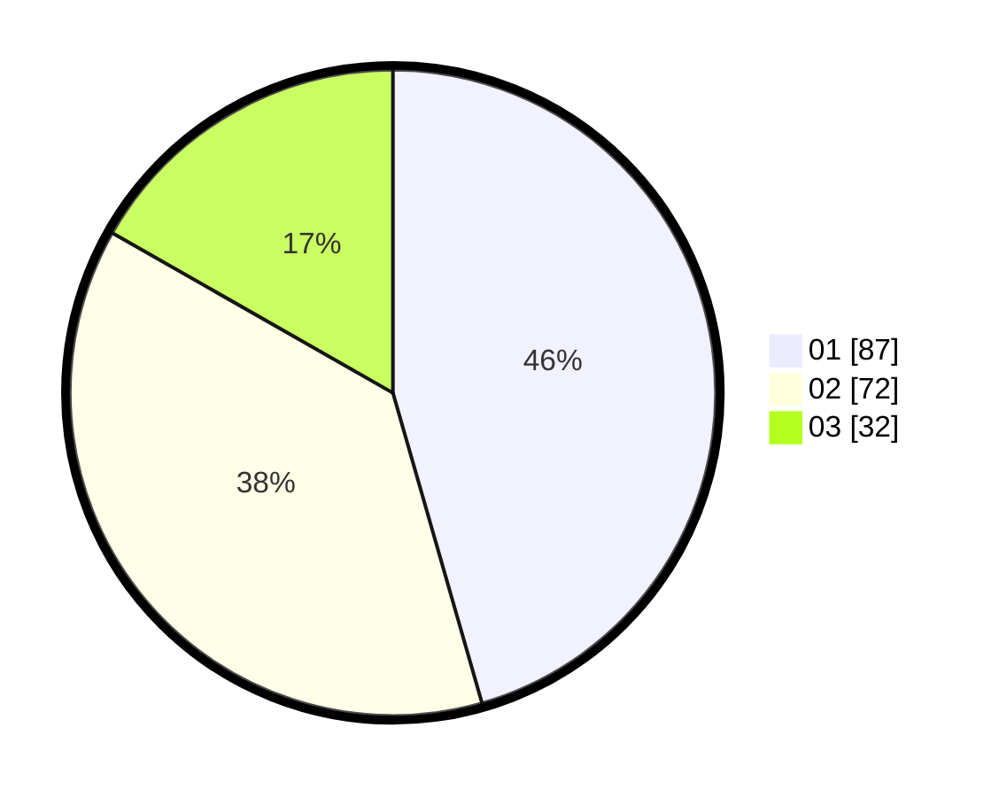

# Hasil

Hasil perolehan suara paslon dapat dilihat pada file paslon-01.txt, paslon-02.txt, dan paslon-03.txt.

Jika tidak ada, artinya data tersebut belum ada pada SIREKAP.

## Perolehan Suara

 * Paslon 01: **87**.
 * Paslon 02: **72**.
 * Paslon 03: **32**.

## Foto C Plano

https://sirekap-obj-formc.kpu.go.id/62bd/pemilu/ppwp/31/73/01/10/04/3173011004091-20240214-192306--5275860e-acb2-419b-a091-40aba0366452.jpg

https://sirekap-obj-formc.kpu.go.id/62bd/pemilu/ppwp/31/73/01/10/04/3173011004091-20240214-192457--45c74614-a69c-4d2c-8ab2-6faf3828e324.jpg

https://sirekap-obj-formc.kpu.go.id/62bd/pemilu/ppwp/31/73/01/10/04/3173011004091-20240214-192546--0be78d8d-0811-4cef-ba21-40a7a428943b.jpg

## DATA PEMILIH TETAP

Jumlah pemilih dalam DPT: **267**.
 * L: **143**.
 * P: **124**.

## DATA PENGGUNA HAK PILIH

Jumlah pengguna hak pilih dalam DPT: **185**.
 * L: **95**.
 * P: **90**.

Jumlah pengguna hak pilih dalam DPTb: **0**.
 * L: **0**.
 * P: **0**.

Jumlah pengguna hak pilih dalam DPK: **6**.
 * L: **2**.
 * P: **4**.

Jumlah pengguna hak pilih: **191**.
 * L: **97**.
 * P: **94**.

## JUMLAH SUARA SAH DAN TIDAK SAH

JUMLAH SELURUH SUARA SAH: **191**.

JUMLAH SUARA TIDAK SAH: **0**.

JUMLAH SELURUH SUARA SAH DAN SUARA TIDAK SAH: **191**.
