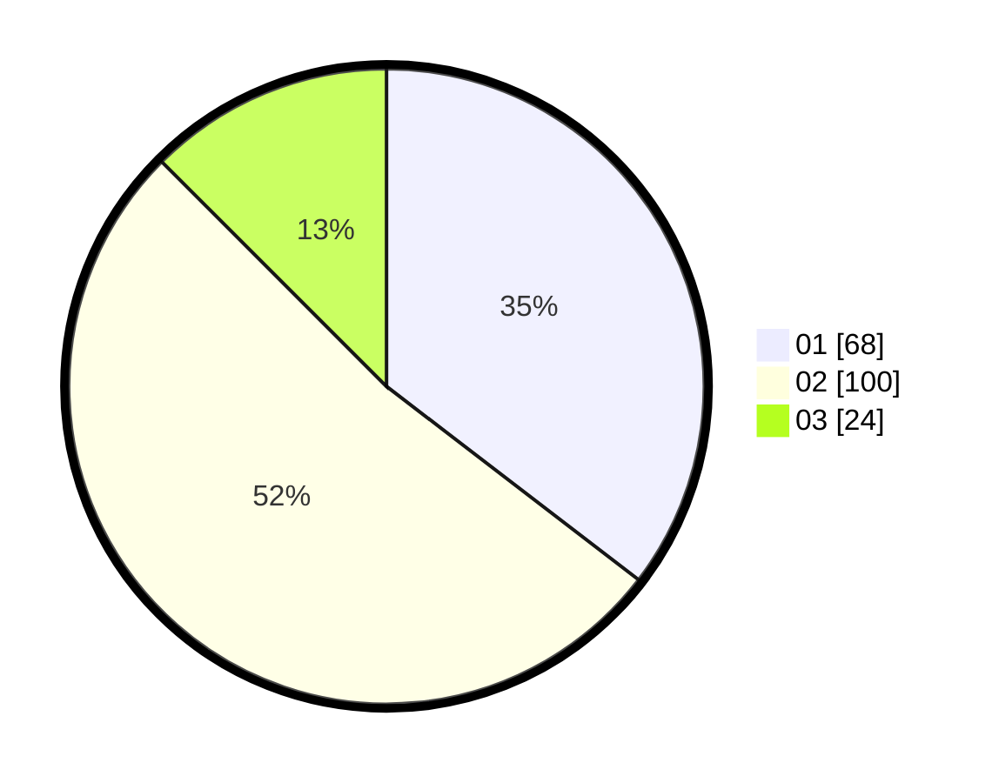

# Hasil

Hasil perolehan suara paslon dapat dilihat pada file paslon-01.txt, paslon-02.txt, dan paslon-03.txt.

Jika tidak ada, artinya data tersebut belum ada pada SIREKAP.

## Perolehan Suara

 * Paslon 01: **68**.
 * Paslon 02: **100**.
 * Paslon 03: **24**.

## Foto C Plano

https://sirekap-obj-formc.kpu.go.id/d50f/pemilu/ppwp/31/73/01/10/04/3173011004093-20240214-191932--9d3e35bc-135e-4925-bdbf-78960c69d559.jpg

https://sirekap-obj-formc.kpu.go.id/d50f/pemilu/ppwp/31/73/01/10/04/3173011004093-20240214-192000--bbc10ecd-8582-4e98-9592-e89a88b4b8e5.jpg

https://sirekap-obj-formc.kpu.go.id/d50f/pemilu/ppwp/31/73/01/10/04/3173011004093-20240214-192024--88c59ba6-4253-4735-a963-6994c660251b.jpg

## DATA PEMILIH TETAP

Jumlah pemilih dalam DPT: **279**.
 * L: **148**.
 * P: **131**.

## DATA PENGGUNA HAK PILIH

Jumlah pengguna hak pilih dalam DPT: **190**.
 * L: **93**.
 * P: **97**.

Jumlah pengguna hak pilih dalam DPTb: **1**.
 * L: **0**.
 * P: **1**.

Jumlah pengguna hak pilih dalam DPK: **3**.
 * L: **2**.
 * P: **1**.

Jumlah pengguna hak pilih: **194**.
 * L: **95**.
 * P: **99**.

## JUMLAH SUARA SAH DAN TIDAK SAH

JUMLAH SELURUH SUARA SAH: **192**.

JUMLAH SUARA TIDAK SAH: **2**.

JUMLAH SELURUH SUARA SAH DAN SUARA TIDAK SAH: **194**.
