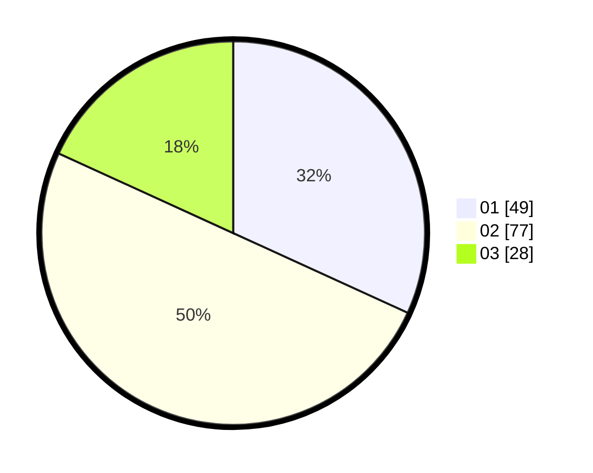

# Hasil

Hasil perolehan suara paslon dapat dilihat pada file paslon-01.txt, paslon-02.txt, dan paslon-03.txt.

Jika tidak ada, artinya data tersebut belum ada pada SIREKAP.

## Perolehan Suara

 * Paslon 01: **49**.
 * Paslon 02: **77**.
 * Paslon 03: **28**.

## Foto C Plano

https://sirekap-obj-formc.kpu.go.id/4358/pemilu/ppwp/31/73/01/10/04/3173011004101-20240215-025508--1cb5669f-a5b4-49b5-ae12-f6fe7d646572.jpg

https://sirekap-obj-formc.kpu.go.id/4358/pemilu/ppwp/31/73/01/10/04/3173011004101-20240215-025545--f215a362-c0e1-4507-bd2e-dbda1e120c7f.jpg

https://sirekap-obj-formc.kpu.go.id/4358/pemilu/ppwp/31/73/01/10/04/3173011004101-20240215-025707--1ba90e27-7e97-4792-a1bc-7f5ebe4b8253.jpg

## DATA PEMILIH TETAP

Jumlah pemilih dalam DPT: **257**.
 * L: **138**.
 * P: **119**.

## DATA PENGGUNA HAK PILIH

Jumlah pengguna hak pilih dalam DPT: **160**.
 * L: **84**.
 * P: **76**.

Jumlah pengguna hak pilih dalam DPTb: **0**.
 * L: **0**.
 * P: **0**.

Jumlah pengguna hak pilih dalam DPK: **1**.
 * L: **1**.
 * P: **0**.

Jumlah pengguna hak pilih: **161**.
 * L: **85**.
 * P: **76**.

## JUMLAH SUARA SAH DAN TIDAK SAH

JUMLAH SELURUH SUARA SAH: **154**.

JUMLAH SUARA TIDAK SAH: **7**.

JUMLAH SELURUH SUARA SAH DAN SUARA TIDAK SAH: **161**.
