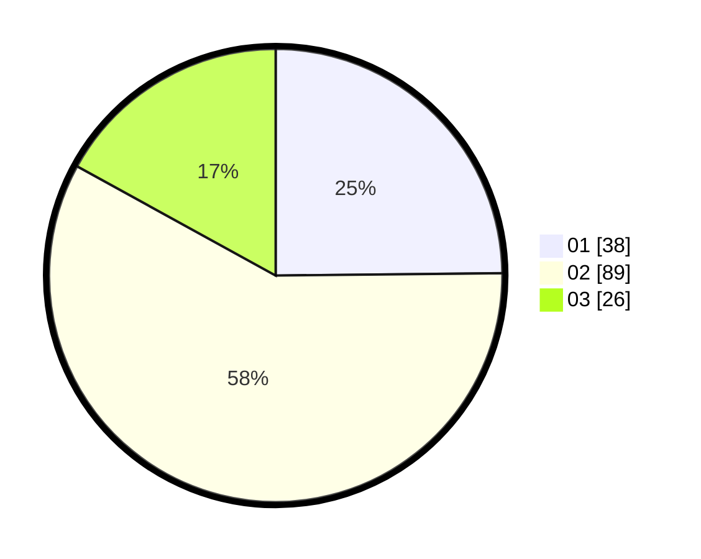

# Hasil

Hasil perolehan suara paslon dapat dilihat pada file paslon-01.txt, paslon-02.txt, dan paslon-03.txt.

Jika tidak ada, artinya data tersebut belum ada pada SIREKAP.

## Perolehan Suara

 * Paslon 01: **38**.
 * Paslon 02: **89**.
 * Paslon 03: **26**.

## Foto C Plano

https://sirekap-obj-formc.kpu.go.id/5c2c/pemilu/ppwp/31/73/01/10/04/3173011004105-20240214-221001--4c877758-bd3a-4d3a-8012-649b18584c07.jpg

https://sirekap-obj-formc.kpu.go.id/5c2c/pemilu/ppwp/31/73/01/10/04/3173011004105-20240214-221133--8189170a-0557-4f98-a2fc-985e371e8ba5.jpg

https://sirekap-obj-formc.kpu.go.id/5c2c/pemilu/ppwp/31/73/01/10/04/3173011004105-20240214-221225--5e17ea2a-74ec-4038-88af-dc62e734b93a.jpg
