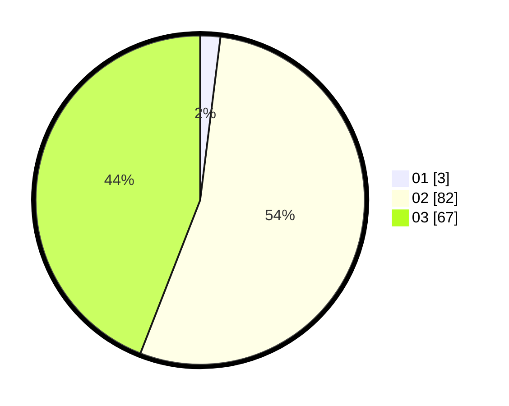

# Hasil

Hasil perolehan suara paslon dapat dilihat pada file paslon-01.txt, paslon-02.txt, dan paslon-03.txt.

Jika tidak ada, artinya data tersebut belum ada pada SIREKAP.

## Perolehan Suara

 * Paslon 01: **3**.
 * Paslon 02: **82**.
 * Paslon 03: **67**.

## Foto C Plano

https://sirekap-obj-formc.kpu.go.id/578c/pemilu/ppwp/31/73/01/10/04/3173011004111-20240214-155111--59248416-e66a-4f97-ae40-6b1ded403880.jpg

https://sirekap-obj-formc.kpu.go.id/578c/pemilu/ppwp/31/73/01/10/04/3173011004111-20240214-195540--ec70742b-461f-4829-8ca6-4a97b3bbca8e.jpg

https://sirekap-obj-formc.kpu.go.id/578c/pemilu/ppwp/31/73/01/10/04/3173011004111-20240214-195629--3d4a12b6-538c-4344-8b1f-e3b428ca79c5.jpg

## DATA PEMILIH TETAP

Jumlah pemilih dalam DPT: **176**.
 * L: **81**.
 * P: **95**.

## DATA PENGGUNA HAK PILIH

Jumlah pengguna hak pilih dalam DPT: **138**.
 * L: **61**.
 * P: **77**.

Jumlah pengguna hak pilih dalam DPTb: **9**.
 * L: **5**.
 * P: **4**.

Jumlah pengguna hak pilih dalam DPK: **7**.
 * L: **3**.
 * P: **4**.

Jumlah pengguna hak pilih: **154**.
 * L: **69**.
 * P: **85**.

## JUMLAH SUARA SAH DAN TIDAK SAH

JUMLAH SELURUH SUARA SAH: **152**.

JUMLAH SUARA TIDAK SAH: **2**.

JUMLAH SELURUH SUARA SAH DAN SUARA TIDAK SAH: **154**.
