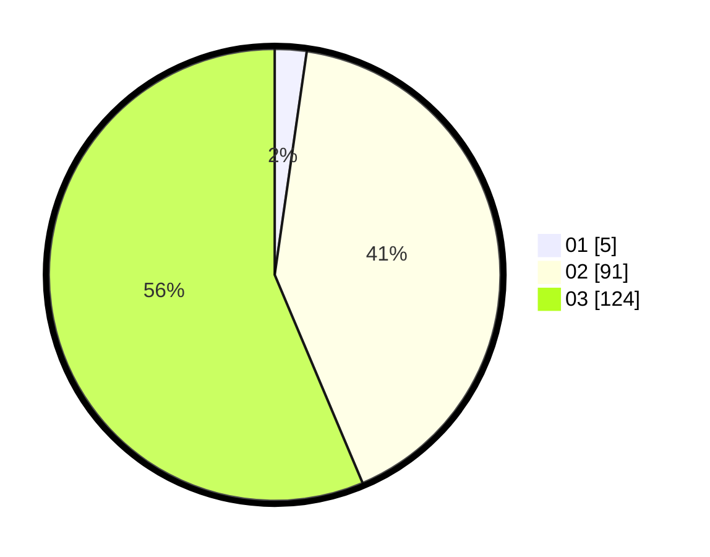

# Hasil

Hasil perolehan suara paslon dapat dilihat pada file paslon-01.txt, paslon-02.txt, dan paslon-03.txt.

Jika tidak ada, artinya data tersebut belum ada pada SIREKAP.

## Perolehan Suara

 * Paslon 01: **5**.
 * Paslon 02: **91**.
 * Paslon 03: **124**.

## Foto C Plano

https://sirekap-obj-formc.kpu.go.id/d77d/pemilu/ppwp/31/73/01/10/04/3173011004113-20240216-175728--2fc1b60b-b039-4766-be84-6319bc97aba5.jpg

https://sirekap-obj-formc.kpu.go.id/d77d/pemilu/ppwp/31/73/01/10/04/3173011004113-20240216-014131--6554ca17-f4dd-4894-8792-b906e3b49b30.jpg

https://sirekap-obj-formc.kpu.go.id/d77d/pemilu/ppwp/31/73/01/10/04/3173011004113-20240216-014131--c2ea8ab3-a726-4195-9cb4-3890e145c854.jpg

## DATA PEMILIH TETAP

Jumlah pemilih dalam DPT: **262**.
 * L: **122**.
 * P: **140**.

## DATA PENGGUNA HAK PILIH

Jumlah pengguna hak pilih dalam DPT: **199**.
 * L: **92**.
 * P: **107**.

Jumlah pengguna hak pilih dalam DPTb: **14**.
 * L: **7**.
 * P: **7**.

Jumlah pengguna hak pilih dalam DPK: **8**.
 * L: **4**.
 * P: **4**.

Jumlah pengguna hak pilih: **221**.
 * L: **103**.
 * P: **118**.

## JUMLAH SUARA SAH DAN TIDAK SAH

JUMLAH SELURUH SUARA SAH: **220**.

JUMLAH SUARA TIDAK SAH: **1**.

JUMLAH SELURUH SUARA SAH DAN SUARA TIDAK SAH: **221**.
