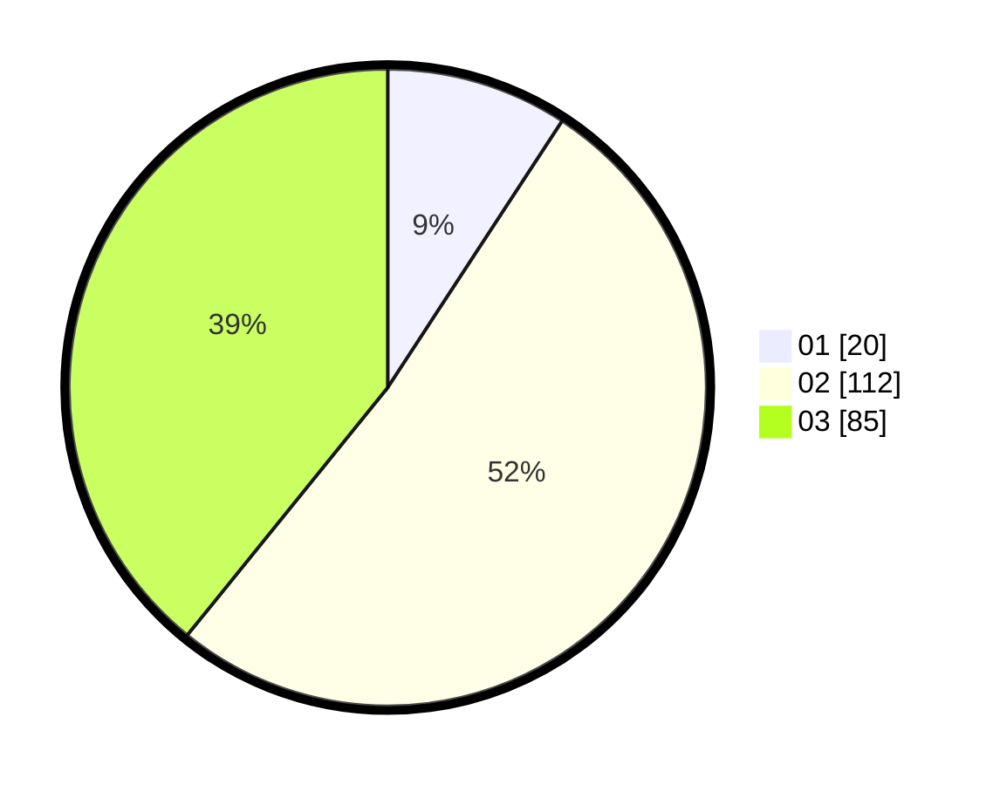

# Hasil

Hasil perolehan suara paslon dapat dilihat pada file paslon-01.txt, paslon-02.txt, dan paslon-03.txt.

Jika tidak ada, artinya data tersebut belum ada pada SIREKAP.

## Perolehan Suara

 * Paslon 01: **20**.
 * Paslon 02: **112**.
 * Paslon 03: **85**.

## Foto C Plano

https://sirekap-obj-formc.kpu.go.id/6405/pemilu/ppwp/31/73/01/10/05/3173011005001-20240214-230544--8471a423-57d7-4b56-8e4e-4af25a5414d2.jpg

https://sirekap-obj-formc.kpu.go.id/6405/pemilu/ppwp/31/73/01/10/05/3173011005001-20240214-230926--5bf3be11-6720-425c-b145-983eeb196c52.jpg

https://sirekap-obj-formc.kpu.go.id/6405/pemilu/ppwp/31/73/01/10/05/3173011005001-20240214-231205--be02fb85-19c9-4821-8555-d749626d5c31.jpg
