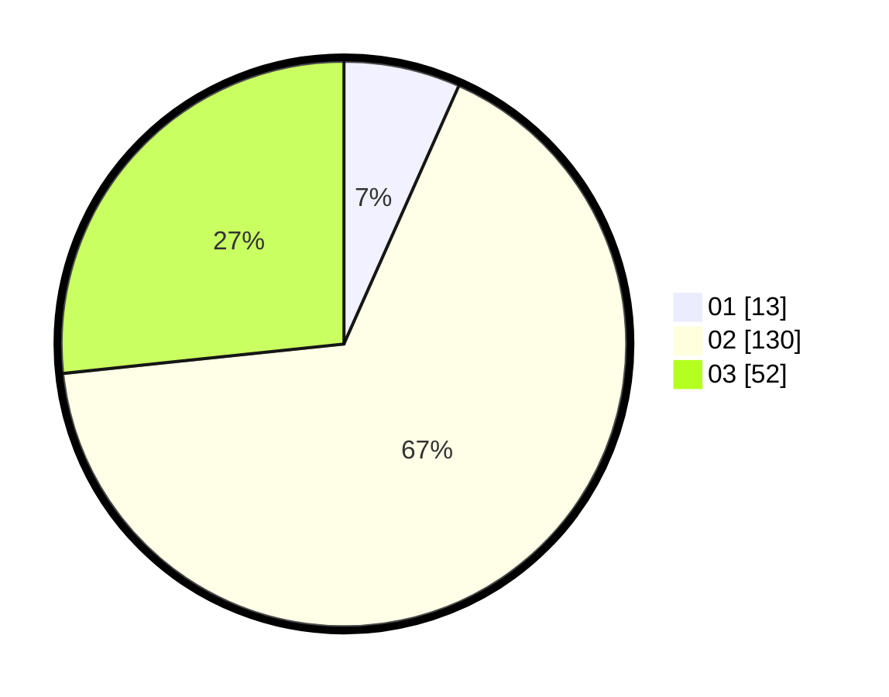

# Hasil

Hasil perolehan suara paslon dapat dilihat pada file paslon-01.txt, paslon-02.txt, dan paslon-03.txt.

Jika tidak ada, artinya data tersebut belum ada pada SIREKAP.

## Perolehan Suara

 * Paslon 01: **13**.
 * Paslon 02: **130**.
 * Paslon 03: **52**.

## Foto C Plano

https://sirekap-obj-formc.kpu.go.id/3ddf/pemilu/ppwp/31/73/01/10/05/3173011005008-20240214-155009--3fb364ad-1886-488b-b2e4-436892db348d.jpg

https://sirekap-obj-formc.kpu.go.id/3ddf/pemilu/ppwp/31/73/01/10/05/3173011005008-20240214-155016--f721800d-3f35-4839-bfe1-4e706663ce00.jpg

https://sirekap-obj-formc.kpu.go.id/3ddf/pemilu/ppwp/31/73/01/10/05/3173011005008-20240214-155021--c1c430fc-ab68-45b6-9cbb-713f9b2781ee.jpg

## DATA PEMILIH TETAP

Jumlah pemilih dalam DPT: **287**.
 * L: **147**.
 * P: **140**.

## DATA PENGGUNA HAK PILIH

Jumlah pengguna hak pilih dalam DPT: **194**.
 * L: **95**.
 * P: **99**.

Jumlah pengguna hak pilih dalam DPTb: **3**.
 * L: **0**.
 * P: **3**.

Jumlah pengguna hak pilih dalam DPK: **0**.
 * L: **0**.
 * P: **0**.

Jumlah pengguna hak pilih: **197**.
 * L: **95**.
 * P: **102**.

## JUMLAH SUARA SAH DAN TIDAK SAH

JUMLAH SELURUH SUARA SAH: **195**.

JUMLAH SUARA TIDAK SAH: **2**.

JUMLAH SELURUH SUARA SAH DAN SUARA TIDAK SAH: **197**.
