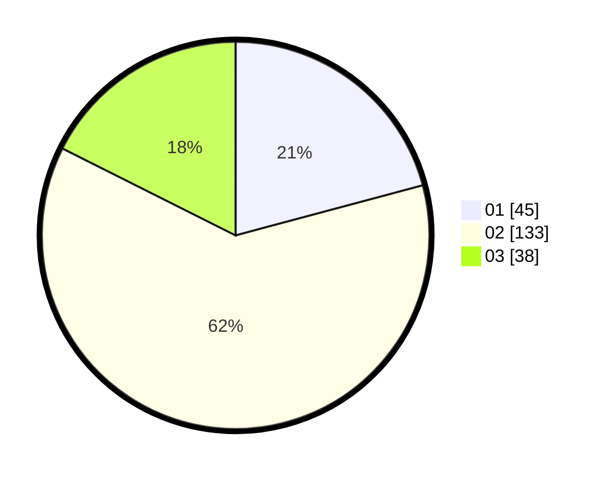

# Hasil

Hasil perolehan suara paslon dapat dilihat pada file paslon-01.txt, paslon-02.txt, dan paslon-03.txt.

Jika tidak ada, artinya data tersebut belum ada pada SIREKAP.

## Perolehan Suara

 * Paslon 01: **45**.
 * Paslon 02: **133**.
 * Paslon 03: **38**.

## Foto C Plano

https://sirekap-obj-formc.kpu.go.id/6cd2/pemilu/ppwp/31/73/01/10/05/3173011005011-20240215-003747--0afe9c59-727d-4eaa-ac0a-e06b251a0270.jpg

https://sirekap-obj-formc.kpu.go.id/6cd2/pemilu/ppwp/31/73/01/10/05/3173011005011-20240215-003808--60ebce23-9990-4295-a1b0-32f97d07ec96.jpg

https://sirekap-obj-formc.kpu.go.id/6cd2/pemilu/ppwp/31/73/01/10/05/3173011005011-20240215-003812--02865e63-8d16-4024-9df3-6a1ac4db815e.jpg

## DATA PEMILIH TETAP

Jumlah pemilih dalam DPT: **291**.
 * L: **150**.
 * P: **141**.

## DATA PENGGUNA HAK PILIH

Jumlah pengguna hak pilih dalam DPT: **216**.
 * L: **110**.
 * P: **106**.

Jumlah pengguna hak pilih dalam DPTb: **2**.
 * L: **1**.
 * P: **1**.

Jumlah pengguna hak pilih dalam DPK: **0**.
 * L: **0**.
 * P: **0**.

Jumlah pengguna hak pilih: **218**.
 * L: **111**.
 * P: **107**.

## JUMLAH SUARA SAH DAN TIDAK SAH

JUMLAH SELURUH SUARA SAH: **216**.

JUMLAH SUARA TIDAK SAH: **2**.

JUMLAH SELURUH SUARA SAH DAN SUARA TIDAK SAH: **218**.
