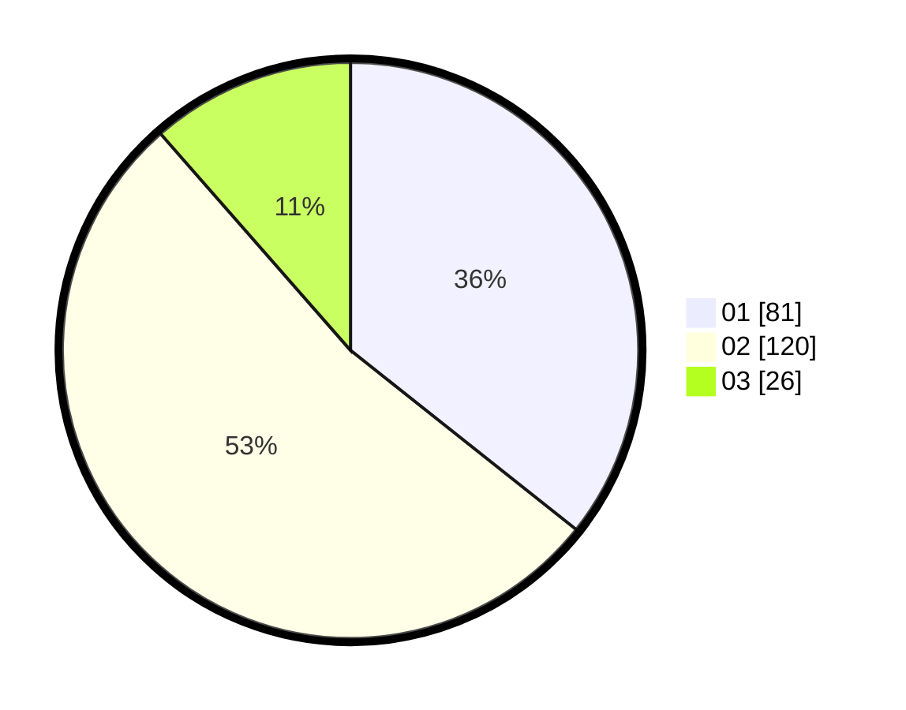

# Hasil

Hasil perolehan suara paslon dapat dilihat pada file paslon-01.txt, paslon-02.txt, dan paslon-03.txt.

Jika tidak ada, artinya data tersebut belum ada pada SIREKAP.

## Perolehan Suara

 * Paslon 01: **81**.
 * Paslon 02: **120**.
 * Paslon 03: **26**.

## Foto C Plano

https://sirekap-obj-formc.kpu.go.id/441d/pemilu/ppwp/31/73/01/10/05/3173011005012-20240214-223702--aa9ee973-e178-4019-8b43-1485843b8704.jpg

https://sirekap-obj-formc.kpu.go.id/441d/pemilu/ppwp/31/73/01/10/05/3173011005012-20240214-223918--47efa69d-bf02-4ad0-8738-f2c74aa7ebf0.jpg

https://sirekap-obj-formc.kpu.go.id/441d/pemilu/ppwp/31/73/01/10/05/3173011005012-20240214-224157--41577cc3-2add-45f3-8374-eaf38e74f1f4.jpg
