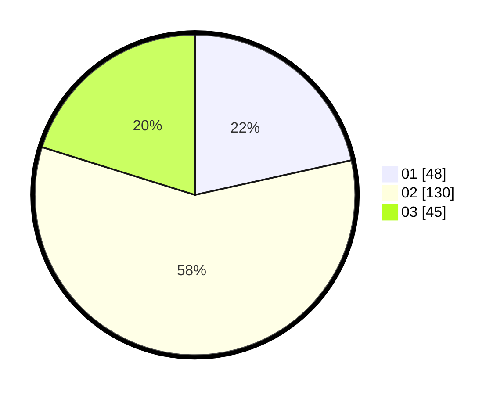

# Hasil

Hasil perolehan suara paslon dapat dilihat pada file paslon-01.txt, paslon-02.txt, dan paslon-03.txt.

Jika tidak ada, artinya data tersebut belum ada pada SIREKAP.

## Perolehan Suara

 * Paslon 01: **48**.
 * Paslon 02: **130**.
 * Paslon 03: **45**.

## Foto C Plano

https://sirekap-obj-formc.kpu.go.id/2686/pemilu/ppwp/31/73/01/10/05/3173011005014-20240214-233351--e1dda964-e547-452c-b8ed-8463b39d3be8.jpg

https://sirekap-obj-formc.kpu.go.id/2686/pemilu/ppwp/31/73/01/10/05/3173011005014-20240214-233505--cde00c2b-008d-4848-b11d-e3bb9af138a9.jpg

https://sirekap-obj-formc.kpu.go.id/2686/pemilu/ppwp/31/73/01/10/05/3173011005014-20240214-233906--f9b4d9ab-dc0a-4486-9c9e-dff3190a7cea.jpg
