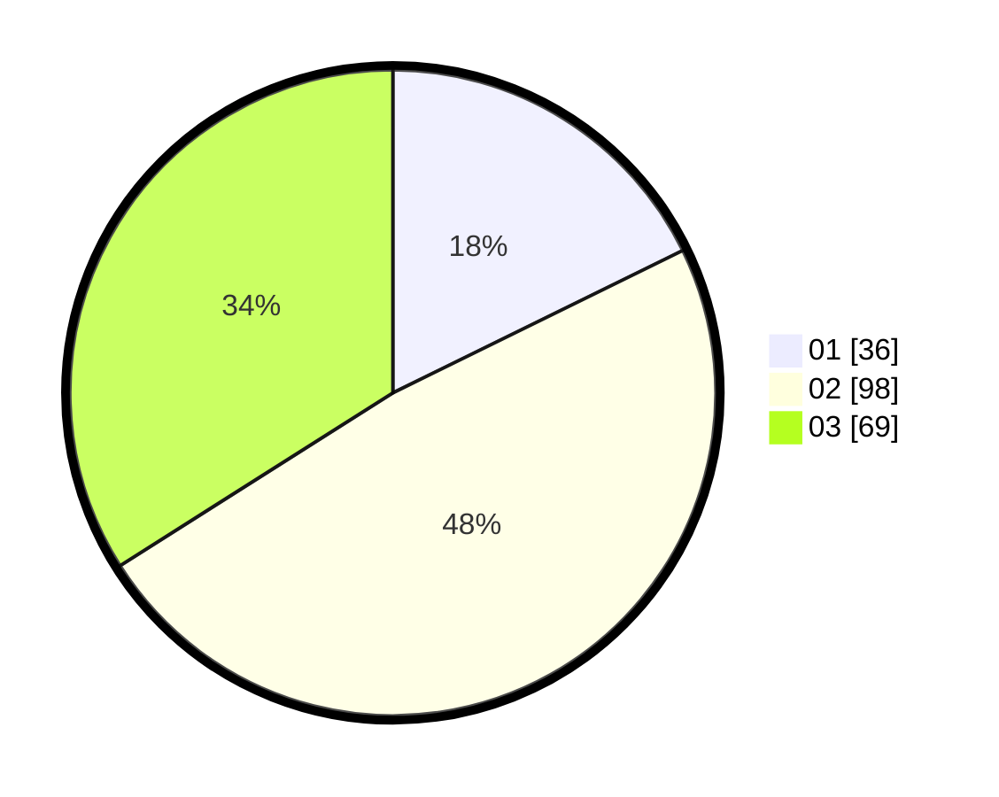

# Hasil

Hasil perolehan suara paslon dapat dilihat pada file paslon-01.txt, paslon-02.txt, dan paslon-03.txt.

Jika tidak ada, artinya data tersebut belum ada pada SIREKAP.

## Perolehan Suara

 * Paslon 01: **36**.
 * Paslon 02: **98**.
 * Paslon 03: **69**.

## Foto C Plano

https://sirekap-obj-formc.kpu.go.id/0656/pemilu/ppwp/31/73/01/10/05/3173011005020-20240215-011102--c9312cae-9b5f-4fc6-babd-4a6692bc11c4.jpg

https://sirekap-obj-formc.kpu.go.id/0656/pemilu/ppwp/31/73/01/10/05/3173011005020-20240215-010808--ad8f8787-2516-46c9-bd79-97edd8f593a8.jpg

https://sirekap-obj-formc.kpu.go.id/0656/pemilu/ppwp/31/73/01/10/05/3173011005020-20240215-011226--ae28f421-57fd-477e-96f2-b1d34a7fa8fd.jpg

## DATA PEMILIH TETAP

Jumlah pemilih dalam DPT: **293**.
 * L: **141**.
 * P: **152**.

## DATA PENGGUNA HAK PILIH

Jumlah pengguna hak pilih dalam DPT: **203**.
 * L: **91**.
 * P: **112**.

Jumlah pengguna hak pilih dalam DPTb: **0**.
 * L: **0**.
 * P: **0**.

Jumlah pengguna hak pilih dalam DPK: **3**.
 * L: **2**.
 * P: **1**.

Jumlah pengguna hak pilih: **206**.
 * L: **93**.
 * P: **113**.

## JUMLAH SUARA SAH DAN TIDAK SAH

JUMLAH SELURUH SUARA SAH: **203**.

JUMLAH SUARA TIDAK SAH: **3**.

JUMLAH SELURUH SUARA SAH DAN SUARA TIDAK SAH: **206**.
