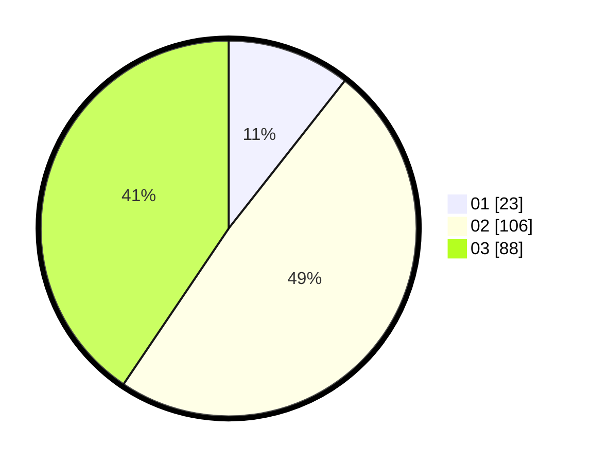

# Hasil

Hasil perolehan suara paslon dapat dilihat pada file paslon-01.txt, paslon-02.txt, dan paslon-03.txt.

Jika tidak ada, artinya data tersebut belum ada pada SIREKAP.

## Perolehan Suara

 * Paslon 01: **23**.
 * Paslon 02: **106**.
 * Paslon 03: **88**.

## Foto C Plano

https://sirekap-obj-formc.kpu.go.id/b558/pemilu/ppwp/31/73/01/10/05/3173011005021-20240215-040846--f8188081-fb1d-4a2a-b0f4-648aa22f8e57.jpg

https://sirekap-obj-formc.kpu.go.id/b558/pemilu/ppwp/31/73/01/10/05/3173011005021-20240215-040920--97ba7df2-9ce7-4c0d-a932-192bcdbd3ba2.jpg

https://sirekap-obj-formc.kpu.go.id/b558/pemilu/ppwp/31/73/01/10/05/3173011005021-20240215-040941--e02ada48-61f0-442f-ba4a-4ed1baed888a.jpg
