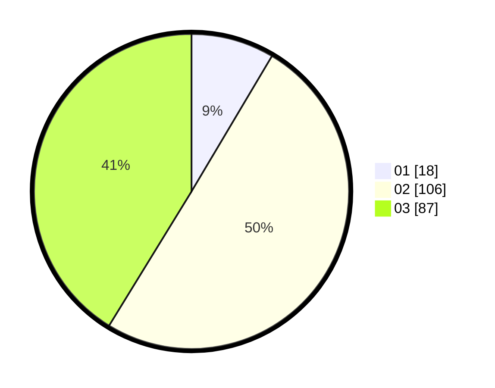

# Hasil

Hasil perolehan suara paslon dapat dilihat pada file paslon-01.txt, paslon-02.txt, dan paslon-03.txt.

Jika tidak ada, artinya data tersebut belum ada pada SIREKAP.

## Perolehan Suara

 * Paslon 01: **18**.
 * Paslon 02: **106**.
 * Paslon 03: **87**.

## Foto C Plano

https://sirekap-obj-formc.kpu.go.id/f656/pemilu/ppwp/31/73/01/10/05/3173011005022-20240216-131939--692e6ad9-78ce-4cb9-bb33-004e28dadec7.jpg

https://sirekap-obj-formc.kpu.go.id/f656/pemilu/ppwp/31/73/01/10/05/3173011005022-20240214-155403--876fe7c3-fe4c-43b7-9a29-938361b5429a.jpg

https://sirekap-obj-formc.kpu.go.id/f656/pemilu/ppwp/31/73/01/10/05/3173011005022-20240214-155323--990266ef-f317-4f78-934e-d44bb1763f98.jpg

## DATA PEMILIH TETAP

Jumlah pemilih dalam DPT: **298**.
 * L: **144**.
 * P: **154**.

## DATA PENGGUNA HAK PILIH

Jumlah pengguna hak pilih dalam DPT: **212**.
 * L: **100**.
 * P: **112**.

Jumlah pengguna hak pilih dalam DPTb: **0**.
 * L: **0**.
 * P: **0**.

Jumlah pengguna hak pilih dalam DPK: **0**.
 * L: **0**.
 * P: **0**.

Jumlah pengguna hak pilih: **212**.
 * L: **100**.
 * P: **112**.

## JUMLAH SUARA SAH DAN TIDAK SAH

JUMLAH SELURUH SUARA SAH: **211**.

JUMLAH SUARA TIDAK SAH: **1**.

JUMLAH SELURUH SUARA SAH DAN SUARA TIDAK SAH: **212**.
