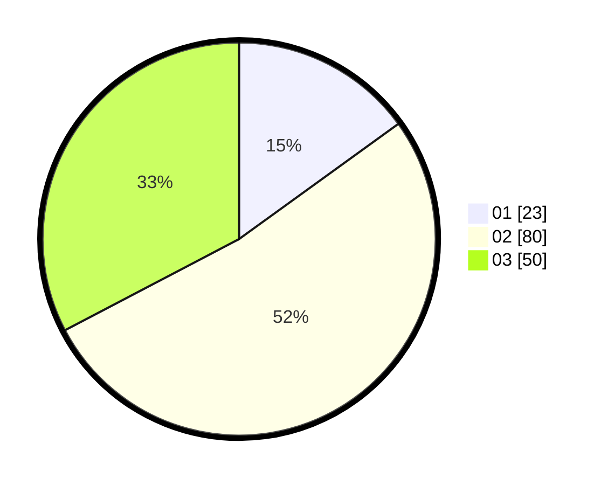

# Hasil

Hasil perolehan suara paslon dapat dilihat pada file paslon-01.txt, paslon-02.txt, dan paslon-03.txt.

Jika tidak ada, artinya data tersebut belum ada pada SIREKAP.

## Perolehan Suara

 * Paslon 01: **23**.
 * Paslon 02: **80**.
 * Paslon 03: **50**.

## Foto C Plano

https://sirekap-obj-formc.kpu.go.id/e7b6/pemilu/ppwp/31/73/01/10/05/3173011005026-20240214-203036--ae719d30-e5da-47b9-ac44-e4b9fab8c28a.jpg

https://sirekap-obj-formc.kpu.go.id/e7b6/pemilu/ppwp/31/73/01/10/05/3173011005026-20240214-203201--43826aff-bd77-4c0f-8151-f0eb4715cb40.jpg

https://sirekap-obj-formc.kpu.go.id/e7b6/pemilu/ppwp/31/73/01/10/05/3173011005026-20240214-203528--e4ccfcdf-287e-4cd4-b903-a68b8b22c267.jpg

## DATA PEMILIH TETAP

Jumlah pemilih dalam DPT: **210**.
 * L: **96**.
 * P: **114**.

## DATA PENGGUNA HAK PILIH

Jumlah pengguna hak pilih dalam DPT: **155**.
 * L: **65**.
 * P: **90**.

Jumlah pengguna hak pilih dalam DPTb: **0**.
 * L: **0**.
 * P: **0**.

Jumlah pengguna hak pilih dalam DPK: **2**.
 * L: **1**.
 * P: **1**.

Jumlah pengguna hak pilih: **157**.
 * L: **66**.
 * P: **91**.

## JUMLAH SUARA SAH DAN TIDAK SAH

JUMLAH SELURUH SUARA SAH: **153**.

JUMLAH SUARA TIDAK SAH: **4**.

JUMLAH SELURUH SUARA SAH DAN SUARA TIDAK SAH: **157**.
