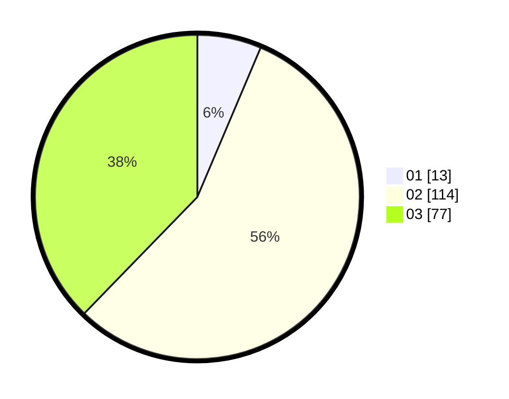

# Hasil

Hasil perolehan suara paslon dapat dilihat pada file paslon-01.txt, paslon-02.txt, dan paslon-03.txt.

Jika tidak ada, artinya data tersebut belum ada pada SIREKAP.

## Perolehan Suara

 * Paslon 01: **13**.
 * Paslon 02: **114**.
 * Paslon 03: **77**.

## Foto C Plano

https://sirekap-obj-formc.kpu.go.id/839e/pemilu/ppwp/31/73/01/10/05/3173011005027-20240215-033754--c79fb4b4-f3e4-4b6d-9d56-2e1bf7dc9ae9.jpg

https://sirekap-obj-formc.kpu.go.id/839e/pemilu/ppwp/31/73/01/10/05/3173011005027-20240214-205406--480207c9-bc77-472e-a9c1-f86b7943c832.jpg

https://sirekap-obj-formc.kpu.go.id/839e/pemilu/ppwp/31/73/01/10/05/3173011005027-20240214-205454--5d0b3af7-a48c-4b05-b00b-c729e183931f.jpg
