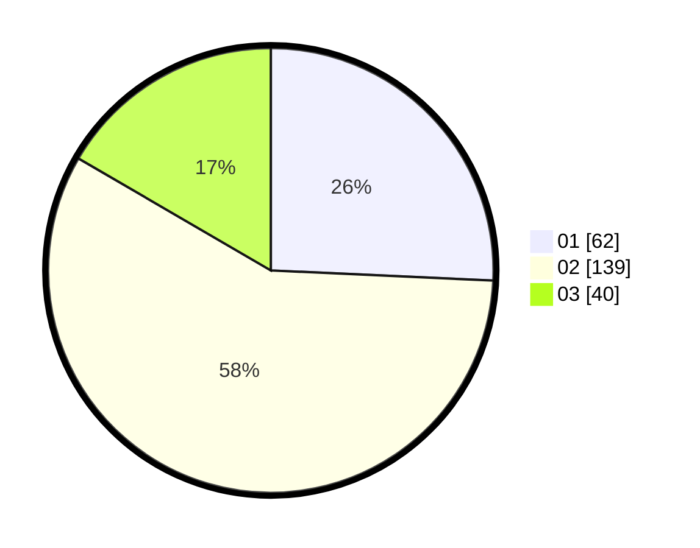

# Hasil

Hasil perolehan suara paslon dapat dilihat pada file paslon-01.txt, paslon-02.txt, dan paslon-03.txt.

Jika tidak ada, artinya data tersebut belum ada pada SIREKAP.

## Perolehan Suara

 * Paslon 01: **62**.
 * Paslon 02: **139**.
 * Paslon 03: **40**.

## Foto C Plano

https://sirekap-obj-formc.kpu.go.id/7445/pemilu/ppwp/31/73/01/10/05/3173011005028-20240214-191439--3674cc1e-b3de-4f2d-ab92-f829e512c00e.jpg

https://sirekap-obj-formc.kpu.go.id/7445/pemilu/ppwp/31/73/01/10/05/3173011005028-20240214-194944--efc8af19-2755-4a9c-a440-687857a3e754.jpg

https://sirekap-obj-formc.kpu.go.id/7445/pemilu/ppwp/31/73/01/10/05/3173011005028-20240214-192508--b86eec95-fa99-4a87-9639-cf416f3810bb.jpg

## DATA PEMILIH TETAP

Jumlah pemilih dalam DPT: **287**.
 * L: **144**.
 * P: **143**.

## DATA PENGGUNA HAK PILIH

Jumlah pengguna hak pilih dalam DPT: **242**.
 * L: **119**.
 * P: **123**.

Jumlah pengguna hak pilih dalam DPTb: **1**.
 * L: **1**.
 * P: **0**.

Jumlah pengguna hak pilih dalam DPK: **0**.
 * L: **0**.
 * P: **0**.

Jumlah pengguna hak pilih: **243**.
 * L: **120**.
 * P: **123**.

## JUMLAH SUARA SAH DAN TIDAK SAH

JUMLAH SELURUH SUARA SAH: **241**.

JUMLAH SUARA TIDAK SAH: **2**.

JUMLAH SELURUH SUARA SAH DAN SUARA TIDAK SAH: **243**.
