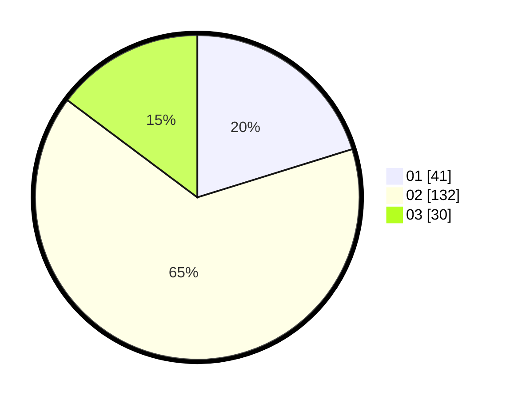

# Hasil

Hasil perolehan suara paslon dapat dilihat pada file paslon-01.txt, paslon-02.txt, dan paslon-03.txt.

Jika tidak ada, artinya data tersebut belum ada pada SIREKAP.

## Perolehan Suara

 * Paslon 01: **41**.
 * Paslon 02: **132**.
 * Paslon 03: **30**.

## Foto C Plano

https://sirekap-obj-formc.kpu.go.id/d9e4/pemilu/ppwp/31/73/01/10/05/3173011005029-20240214-190548--3565e64e-3a94-4946-8a0b-0f7f11e3943a.jpg

https://sirekap-obj-formc.kpu.go.id/d9e4/pemilu/ppwp/31/73/01/10/05/3173011005029-20240214-190923--e580bbd3-6d91-4a50-a8da-8d344b0e4f47.jpg

https://sirekap-obj-formc.kpu.go.id/d9e4/pemilu/ppwp/31/73/01/10/05/3173011005029-20240214-191007--5ed51585-cdd0-4e5b-9232-dc8a44c24771.jpg
