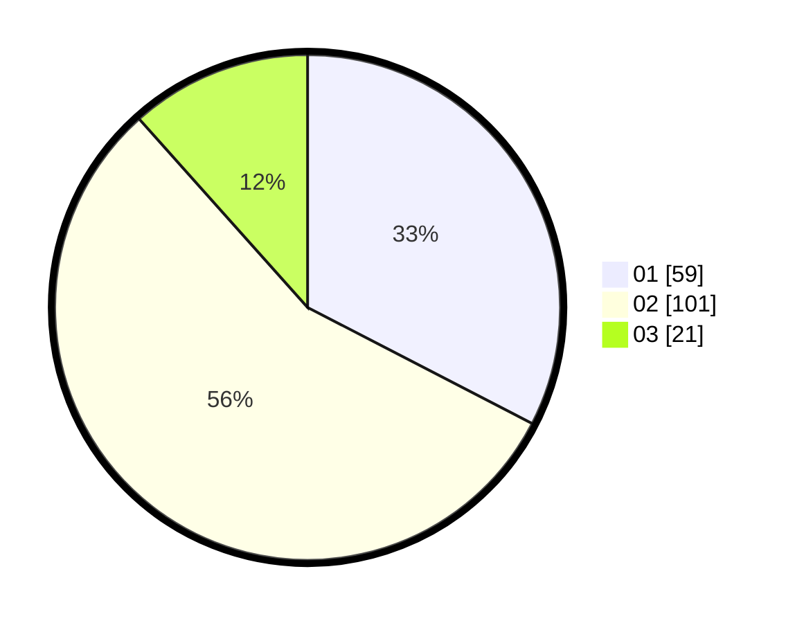

# Hasil

Hasil perolehan suara paslon dapat dilihat pada file paslon-01.txt, paslon-02.txt, dan paslon-03.txt.

Jika tidak ada, artinya data tersebut belum ada pada SIREKAP.

## Perolehan Suara

 * Paslon 01: **59**.
 * Paslon 02: **101**.
 * Paslon 03: **21**.

## Foto C Plano

https://sirekap-obj-formc.kpu.go.id/a855/pemilu/ppwp/31/73/01/10/05/3173011005036-20240216-053414--be4aab82-ff81-43b4-95cd-5edfe02437ce.jpg

https://sirekap-obj-formc.kpu.go.id/a855/pemilu/ppwp/31/73/01/10/05/3173011005036-20240216-054130--f71391c7-488c-4d57-949d-43e8f0a5a21f.jpg

https://sirekap-obj-formc.kpu.go.id/a855/pemilu/ppwp/31/73/01/10/05/3173011005036-20240216-053421--3d85d696-22dd-41ef-a91c-d1dc0198bb59.jpg

## DATA PEMILIH TETAP

Jumlah pemilih dalam DPT: **232**.
 * L: **112**.
 * P: **120**.

## DATA PENGGUNA HAK PILIH

Jumlah pengguna hak pilih dalam DPT: **179**.
 * L: **83**.
 * P: **96**.

Jumlah pengguna hak pilih dalam DPTb: **0**.
 * L: **0**.
 * P: **0**.

Jumlah pengguna hak pilih dalam DPK: **2**.
 * L: **1**.
 * P: **1**.

Jumlah pengguna hak pilih: **181**.
 * L: **84**.
 * P: **97**.

## JUMLAH SUARA SAH DAN TIDAK SAH

JUMLAH SELURUH SUARA SAH: **181**.

JUMLAH SUARA TIDAK SAH: **0**.

JUMLAH SELURUH SUARA SAH DAN SUARA TIDAK SAH: **181**.
