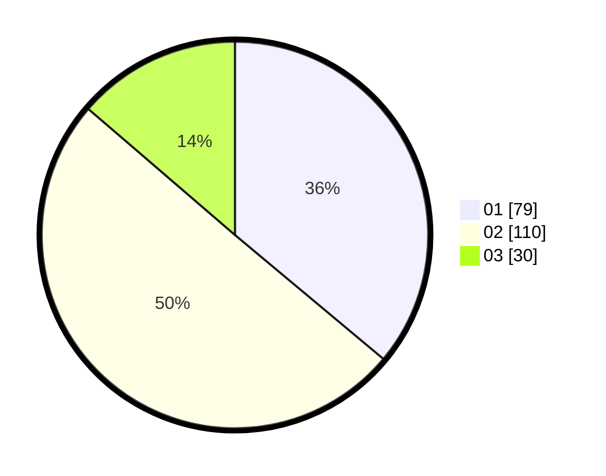

# Hasil

Hasil perolehan suara paslon dapat dilihat pada file paslon-01.txt, paslon-02.txt, dan paslon-03.txt.

Jika tidak ada, artinya data tersebut belum ada pada SIREKAP.

## Perolehan Suara

 * Paslon 01: **79**.
 * Paslon 02: **110**.
 * Paslon 03: **30**.

## Foto C Plano

https://sirekap-obj-formc.kpu.go.id/b9f0/pemilu/ppwp/31/73/01/10/05/3173011005039-20240214-230404--be07b29b-978b-4cbb-accf-3e2da16e86e0.jpg

https://sirekap-obj-formc.kpu.go.id/b9f0/pemilu/ppwp/31/73/01/10/05/3173011005039-20240214-230802--cd4fe297-0adf-44cd-8ce4-e8ad70cd4cc0.jpg

https://sirekap-obj-formc.kpu.go.id/b9f0/pemilu/ppwp/31/73/01/10/05/3173011005039-20240214-230922--1ea6586c-e106-4d7e-aeb3-04e54d2d6f18.jpg

## DATA PEMILIH TETAP

Jumlah pemilih dalam DPT: **294**.
 * L: **155**.
 * P: **139**.

## DATA PENGGUNA HAK PILIH

Jumlah pengguna hak pilih dalam DPT: **220**.
 * L: **114**.
 * P: **106**.

Jumlah pengguna hak pilih dalam DPTb: **0**.
 * L: **0**.
 * P: **0**.

Jumlah pengguna hak pilih dalam DPK: **0**.
 * L: **0**.
 * P: **0**.

Jumlah pengguna hak pilih: **220**.
 * L: **114**.
 * P: **106**.

## JUMLAH SUARA SAH DAN TIDAK SAH

JUMLAH SELURUH SUARA SAH: **219**.

JUMLAH SUARA TIDAK SAH: **1**.

JUMLAH SELURUH SUARA SAH DAN SUARA TIDAK SAH: **220**.
