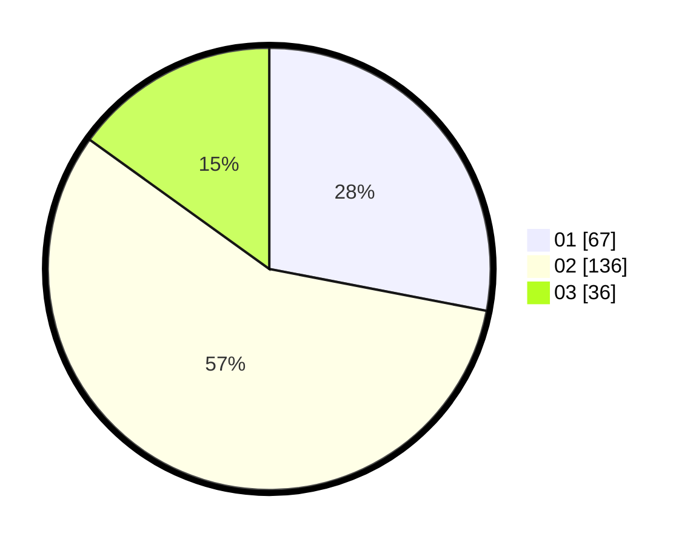

# Hasil

Hasil perolehan suara paslon dapat dilihat pada file paslon-01.txt, paslon-02.txt, dan paslon-03.txt.

Jika tidak ada, artinya data tersebut belum ada pada SIREKAP.

## Perolehan Suara

 * Paslon 01: **67**.
 * Paslon 02: **136**.
 * Paslon 03: **36**.

## Foto C Plano

https://sirekap-obj-formc.kpu.go.id/b188/pemilu/ppwp/31/73/01/10/05/3173011005040-20240214-221414--3e77b4d5-d4c4-4525-9be2-45f3cc774c6c.jpg

https://sirekap-obj-formc.kpu.go.id/b188/pemilu/ppwp/31/73/01/10/05/3173011005040-20240214-192343--4a8fd601-ca40-4fee-a0a9-34a808499a60.jpg

https://sirekap-obj-formc.kpu.go.id/b188/pemilu/ppwp/31/73/01/10/05/3173011005040-20240214-192458--52cde50d-294a-4198-8106-46499802493f.jpg
