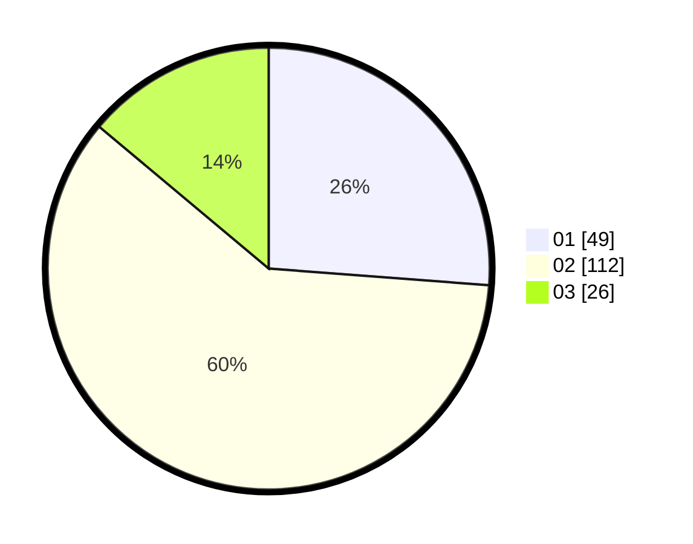

# Hasil

Hasil perolehan suara paslon dapat dilihat pada file paslon-01.txt, paslon-02.txt, dan paslon-03.txt.

Jika tidak ada, artinya data tersebut belum ada pada SIREKAP.

## Perolehan Suara

 * Paslon 01: **49**.
 * Paslon 02: **112**.
 * Paslon 03: **26**.

## Foto C Plano

https://sirekap-obj-formc.kpu.go.id/eb8e/pemilu/ppwp/31/73/01/10/05/3173011005043-20240215-044204--b87aca09-a27c-46dd-940c-237a90ad825b.jpg

https://sirekap-obj-formc.kpu.go.id/eb8e/pemilu/ppwp/31/73/01/10/05/3173011005043-20240215-044212--4f1ce11e-b40e-46b2-8425-ec8be6c939d0.jpg

https://sirekap-obj-formc.kpu.go.id/eb8e/pemilu/ppwp/31/73/01/10/05/3173011005043-20240215-044224--27583286-e0f0-4acc-b08d-2f482b8d34c7.jpg
