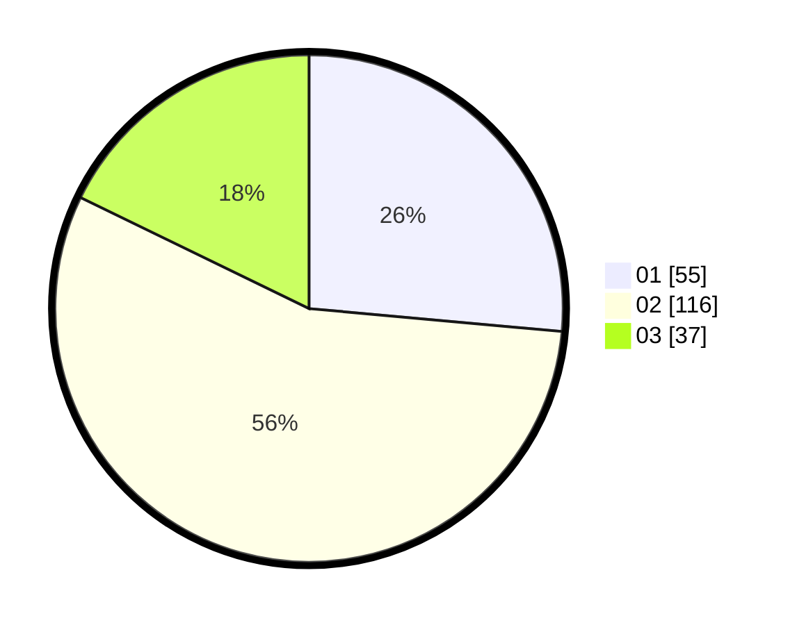

# Hasil

Hasil perolehan suara paslon dapat dilihat pada file paslon-01.txt, paslon-02.txt, dan paslon-03.txt.

Jika tidak ada, artinya data tersebut belum ada pada SIREKAP.

## Perolehan Suara

 * Paslon 01: **55**.
 * Paslon 02: **116**.
 * Paslon 03: **37**.

## Foto C Plano

https://sirekap-obj-formc.kpu.go.id/044f/pemilu/ppwp/31/73/01/10/05/3173011005044-20240215-021803--f548399a-8122-41f4-a042-d3074552cc30.jpg

https://sirekap-obj-formc.kpu.go.id/044f/pemilu/ppwp/31/73/01/10/05/3173011005044-20240215-021925--a3599720-8c87-43a1-8baa-360d662c1094.jpg
