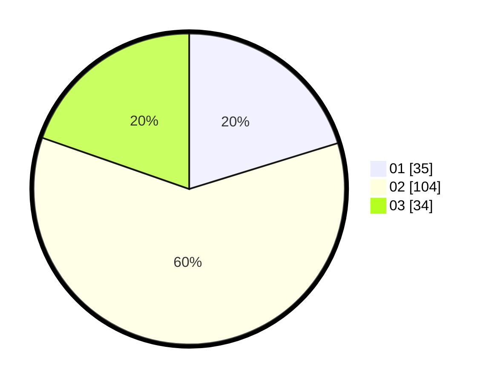

# Hasil

Hasil perolehan suara paslon dapat dilihat pada file paslon-01.txt, paslon-02.txt, dan paslon-03.txt.

Jika tidak ada, artinya data tersebut belum ada pada SIREKAP.

## Perolehan Suara

 * Paslon 01: **35**.
 * Paslon 02: **104**.
 * Paslon 03: **34**.

## Foto C Plano

https://sirekap-obj-formc.kpu.go.id/db40/pemilu/ppwp/31/73/01/10/05/3173011005045-20240215-005857--c674f825-929e-4f69-a09a-c82b9b575ec2.jpg

https://sirekap-obj-formc.kpu.go.id/db40/pemilu/ppwp/31/73/01/10/05/3173011005045-20240214-215518--a1441478-82b5-415c-91b3-442f0e87809b.jpg

https://sirekap-obj-formc.kpu.go.id/db40/pemilu/ppwp/31/73/01/10/05/3173011005045-20240215-010315--e89795aa-c831-4d37-823c-9610269db2bf.jpg
