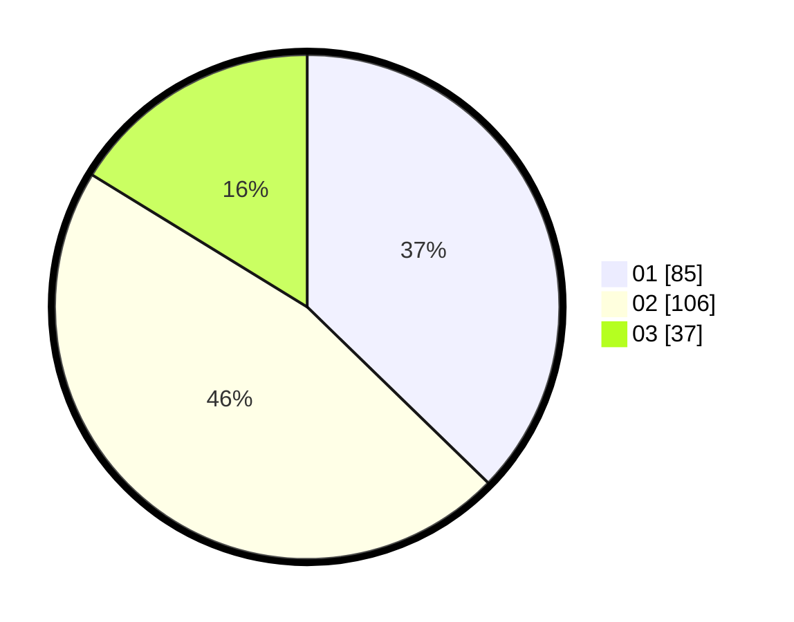

# Hasil

Hasil perolehan suara paslon dapat dilihat pada file paslon-01.txt, paslon-02.txt, dan paslon-03.txt.

Jika tidak ada, artinya data tersebut belum ada pada SIREKAP.

## Perolehan Suara

 * Paslon 01: **85**.
 * Paslon 02: **106**.
 * Paslon 03: **37**.

## Foto C Plano

https://sirekap-obj-formc.kpu.go.id/9c92/pemilu/ppwp/31/73/01/10/05/3173011005046-20240214-205317--b5858df0-4f8f-422b-a007-7884b098f756.jpg

https://sirekap-obj-formc.kpu.go.id/9c92/pemilu/ppwp/31/73/01/10/05/3173011005046-20240214-205727--44b02d79-cf0c-490a-a687-4455f93160a8.jpg

https://sirekap-obj-formc.kpu.go.id/9c92/pemilu/ppwp/31/73/01/10/05/3173011005046-20240214-220403--d89f2f12-d4e3-4e89-b816-c0f4f97e494f.jpg
