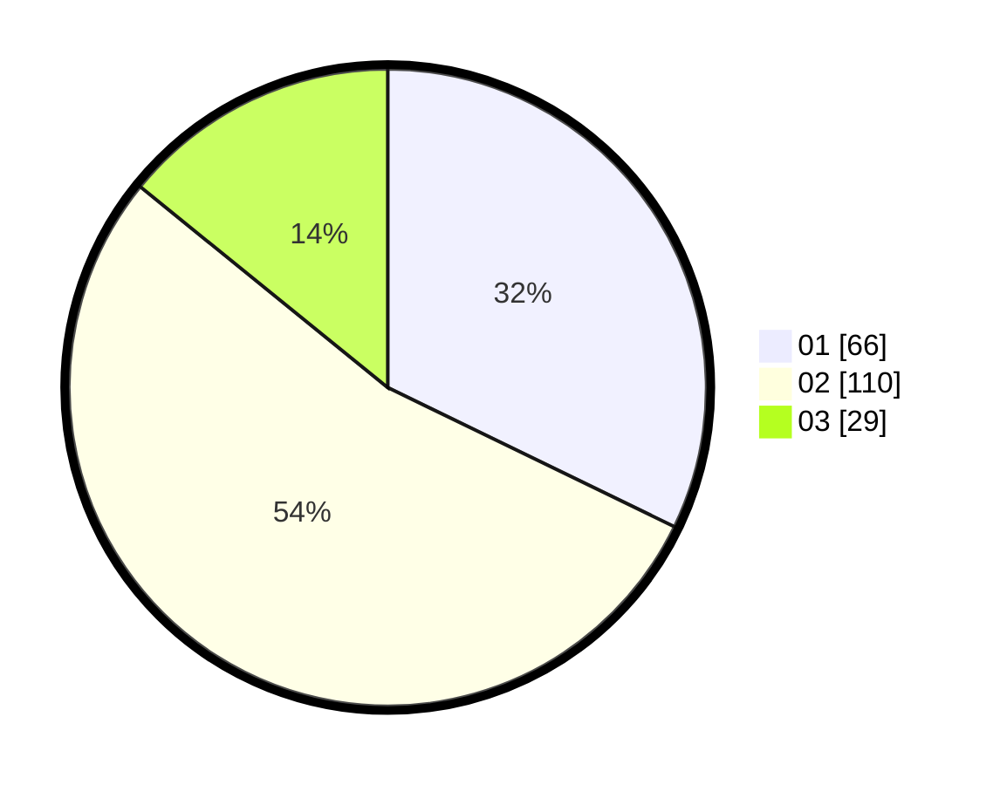

# Hasil

Hasil perolehan suara paslon dapat dilihat pada file paslon-01.txt, paslon-02.txt, dan paslon-03.txt.

Jika tidak ada, artinya data tersebut belum ada pada SIREKAP.

## Perolehan Suara

 * Paslon 01: **66**.
 * Paslon 02: **110**.
 * Paslon 03: **29**.

## Foto C Plano

https://sirekap-obj-formc.kpu.go.id/ff78/pemilu/ppwp/31/73/01/10/05/3173011005047-20240214-191216--4c1ef4a8-8646-4ac2-ba21-0ca43dfe2a7f.jpg

https://sirekap-obj-formc.kpu.go.id/ff78/pemilu/ppwp/31/73/01/10/05/3173011005047-20240214-191329--829a216e-587f-42a8-ba03-df7fdb55324c.jpg

https://sirekap-obj-formc.kpu.go.id/ff78/pemilu/ppwp/31/73/01/10/05/3173011005047-20240214-191353--5a17c320-8143-4183-b7b7-21fd8f95772d.jpg

## DATA PEMILIH TETAP

Jumlah pemilih dalam DPT: **284**.
 * L: **136**.
 * P: **148**.

## DATA PENGGUNA HAK PILIH

Jumlah pengguna hak pilih dalam DPT: **208**.
 * L: **102**.
 * P: **106**.

Jumlah pengguna hak pilih dalam DPTb: **0**.
 * L: **0**.
 * P: **0**.

Jumlah pengguna hak pilih dalam DPK: **0**.
 * L: **0**.
 * P: **0**.

Jumlah pengguna hak pilih: **208**.
 * L: **102**.
 * P: **106**.

## JUMLAH SUARA SAH DAN TIDAK SAH

JUMLAH SELURUH SUARA SAH: **205**.

JUMLAH SUARA TIDAK SAH: **3**.

JUMLAH SELURUH SUARA SAH DAN SUARA TIDAK SAH: **208**.
