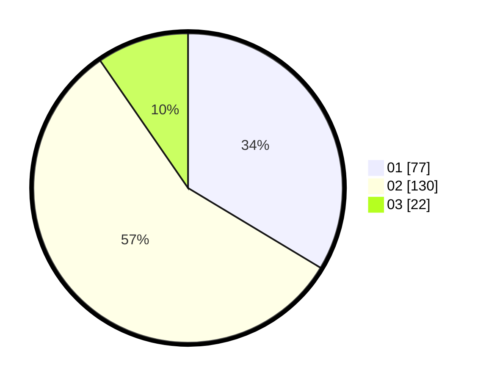

# Hasil

Hasil perolehan suara paslon dapat dilihat pada file paslon-01.txt, paslon-02.txt, dan paslon-03.txt.

Jika tidak ada, artinya data tersebut belum ada pada SIREKAP.

## Perolehan Suara

 * Paslon 01: **77**.
 * Paslon 02: **130**.
 * Paslon 03: **22**.

## Foto C Plano

https://sirekap-obj-formc.kpu.go.id/f488/pemilu/ppwp/31/73/01/10/05/3173011005049-20240214-160115--81e4d040-ca63-4804-9dd1-333b87fe1b6a.jpg

https://sirekap-obj-formc.kpu.go.id/f488/pemilu/ppwp/31/73/01/10/05/3173011005049-20240216-003605--d45a05d4-10f3-4d4f-8c6f-5212f67216bc.jpg

https://sirekap-obj-formc.kpu.go.id/f488/pemilu/ppwp/31/73/01/10/05/3173011005049-20240216-003601--f05e6592-30b5-4ca8-add9-e6100bb54491.jpg

## DATA PEMILIH TETAP

Jumlah pemilih dalam DPT: **283**.
 * L: **139**.
 * P: **144**.

## DATA PENGGUNA HAK PILIH

Jumlah pengguna hak pilih dalam DPT: **230**.
 * L: **118**.
 * P: **112**.

Jumlah pengguna hak pilih dalam DPTb: **0**.
 * L: **0**.
 * P: **0**.

Jumlah pengguna hak pilih dalam DPK: **0**.
 * L: **0**.
 * P: **0**.

Jumlah pengguna hak pilih: **230**.
 * L: **118**.
 * P: **112**.

## JUMLAH SUARA SAH DAN TIDAK SAH

JUMLAH SELURUH SUARA SAH: **229**.

JUMLAH SUARA TIDAK SAH: **1**.

JUMLAH SELURUH SUARA SAH DAN SUARA TIDAK SAH: **230**.
