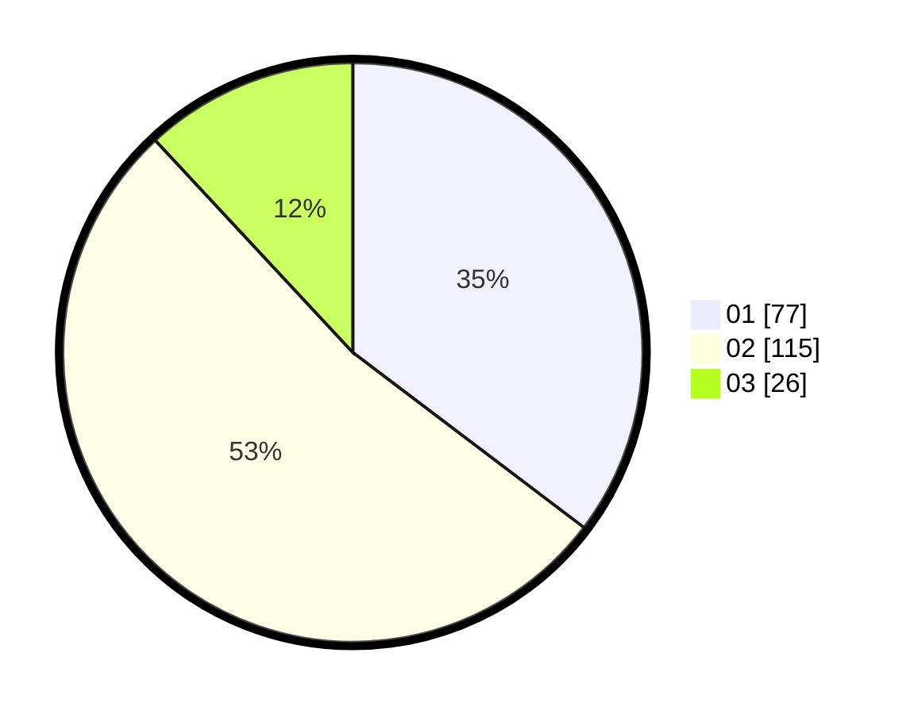

# Hasil

Hasil perolehan suara paslon dapat dilihat pada file paslon-01.txt, paslon-02.txt, dan paslon-03.txt.

Jika tidak ada, artinya data tersebut belum ada pada SIREKAP.

## Perolehan Suara

 * Paslon 01: **77**.
 * Paslon 02: **115**.
 * Paslon 03: **26**.

## Foto C Plano

https://sirekap-obj-formc.kpu.go.id/723f/pemilu/ppwp/31/73/01/10/05/3173011005055-20240214-195609--30725b03-369d-434f-83c0-5b815fe62d72.jpg

https://sirekap-obj-formc.kpu.go.id/723f/pemilu/ppwp/31/73/01/10/05/3173011005055-20240214-195711--534f7c58-fc22-40af-8aa2-0e32cd60a3df.jpg
