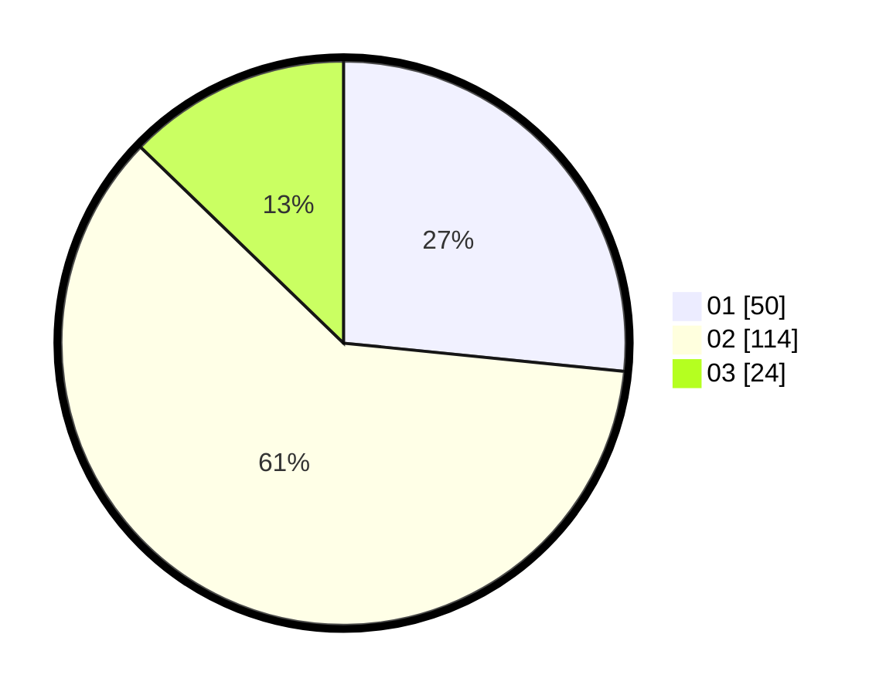

# Hasil

Hasil perolehan suara paslon dapat dilihat pada file paslon-01.txt, paslon-02.txt, dan paslon-03.txt.

Jika tidak ada, artinya data tersebut belum ada pada SIREKAP.

## Perolehan Suara

 * Paslon 01: **50**.
 * Paslon 02: **114**.
 * Paslon 03: **24**.

## Foto C Plano

https://sirekap-obj-formc.kpu.go.id/e6c1/pemilu/ppwp/31/73/01/10/05/3173011005056-20240214-193737--6fbf9546-7a9f-4226-a827-249ccf9e3d95.jpg

https://sirekap-obj-formc.kpu.go.id/e6c1/pemilu/ppwp/31/73/01/10/05/3173011005056-20240214-193741--fba11e6a-8e03-4651-80ab-0743fb918566.jpg

https://sirekap-obj-formc.kpu.go.id/e6c1/pemilu/ppwp/31/73/01/10/05/3173011005056-20240214-193745--c7dbab19-ebcb-4acb-b833-ff8d70dd7417.jpg

## DATA PEMILIH TETAP

Jumlah pemilih dalam DPT: **284**.
 * L: **175**.
 * P: **145**.

## DATA PENGGUNA HAK PILIH

Jumlah pengguna hak pilih dalam DPT: **707**.
 * L: **89**.
 * P: **114**.

Jumlah pengguna hak pilih dalam DPTb: **0**.
 * L: **0**.
 * P: **0**.

Jumlah pengguna hak pilih dalam DPK: **0**.
 * L: **0**.
 * P: **0**.

Jumlah pengguna hak pilih: **207**.
 * L: **84**.
 * P: **114**.

## JUMLAH SUARA SAH DAN TIDAK SAH

JUMLAH SELURUH SUARA SAH: **202**.

JUMLAH SUARA TIDAK SAH: **1**.

JUMLAH SELURUH SUARA SAH DAN SUARA TIDAK SAH: **307**.
