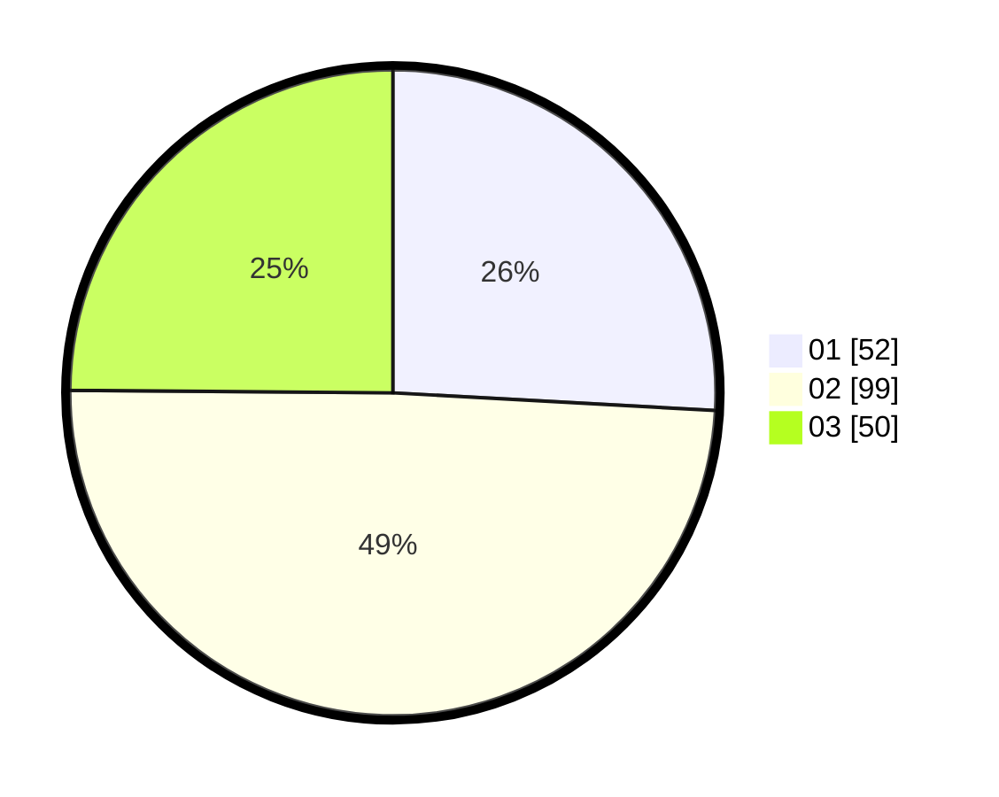

# Hasil

Hasil perolehan suara paslon dapat dilihat pada file paslon-01.txt, paslon-02.txt, dan paslon-03.txt.

Jika tidak ada, artinya data tersebut belum ada pada SIREKAP.

## Perolehan Suara

 * Paslon 01: **52**.
 * Paslon 02: **99**.
 * Paslon 03: **50**.

## Foto C Plano

https://sirekap-obj-formc.kpu.go.id/7ff1/pemilu/ppwp/31/73/01/10/05/3173011005059-20240214-225418--8470c510-b5c3-424a-ad0e-1336f8fa7559.jpg

https://sirekap-obj-formc.kpu.go.id/7ff1/pemilu/ppwp/31/73/01/10/05/3173011005059-20240214-225525--72b02f44-9463-440e-9a06-c6fbbd2dce6b.jpg

https://sirekap-obj-formc.kpu.go.id/7ff1/pemilu/ppwp/31/73/01/10/05/3173011005059-20240214-225636--1e429f83-be54-4c60-a1e4-9b22509f97bf.jpg

## DATA PEMILIH TETAP

Jumlah pemilih dalam DPT: **286**.
 * L: **145**.
 * P: **141**.

## DATA PENGGUNA HAK PILIH

Jumlah pengguna hak pilih dalam DPT: **202**.
 * L: **103**.
 * P: **99**.

Jumlah pengguna hak pilih dalam DPTb: **0**.
 * L: **0**.
 * P: **0**.

Jumlah pengguna hak pilih dalam DPK: **0**.
 * L: **0**.
 * P: **0**.

Jumlah pengguna hak pilih: **202**.
 * L: **103**.
 * P: **99**.

## JUMLAH SUARA SAH DAN TIDAK SAH

JUMLAH SELURUH SUARA SAH: **201**.

JUMLAH SUARA TIDAK SAH: **1**.

JUMLAH SELURUH SUARA SAH DAN SUARA TIDAK SAH: **202**.
