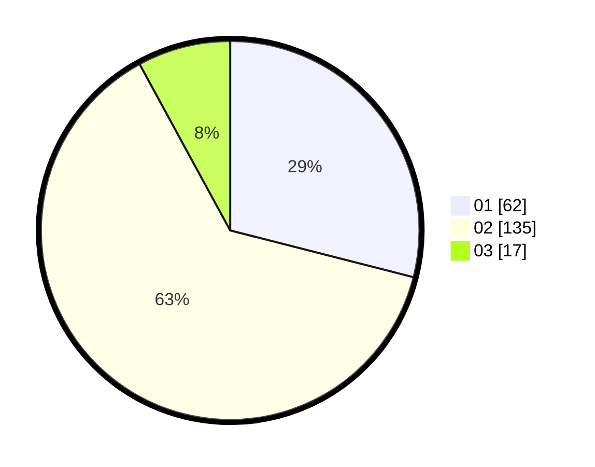

# Hasil

Hasil perolehan suara paslon dapat dilihat pada file paslon-01.txt, paslon-02.txt, dan paslon-03.txt.

Jika tidak ada, artinya data tersebut belum ada pada SIREKAP.

## Perolehan Suara

 * Paslon 01: **62**.
 * Paslon 02: **135**.
 * Paslon 03: **17**.

## Foto C Plano

https://sirekap-obj-formc.kpu.go.id/baa7/pemilu/ppwp/31/73/01/10/05/3173011005063-20240214-202151--c8a755b4-22a0-4217-b40c-6f3eccf94bc3.jpg

https://sirekap-obj-formc.kpu.go.id/baa7/pemilu/ppwp/31/73/01/10/05/3173011005063-20240214-201948--991dbdaf-31c0-4797-af3d-f26825106fd0.jpg

https://sirekap-obj-formc.kpu.go.id/baa7/pemilu/ppwp/31/73/01/10/05/3173011005063-20240214-202356--601d8f10-075d-453c-8c1f-5fd7cdb19e82.jpg

## DATA PEMILIH TETAP

Jumlah pemilih dalam DPT: **290**.
 * L: **155**.
 * P: **135**.

## DATA PENGGUNA HAK PILIH

Jumlah pengguna hak pilih dalam DPT: **219**.
 * L: **111**.
 * P: **108**.

Jumlah pengguna hak pilih dalam DPTb: **0**.
 * L: **0**.
 * P: **0**.

Jumlah pengguna hak pilih dalam DPK: **0**.
 * L: **0**.
 * P: **0**.

Jumlah pengguna hak pilih: **219**.
 * L: **111**.
 * P: **108**.

## JUMLAH SUARA SAH DAN TIDAK SAH

JUMLAH SELURUH SUARA SAH: **214**.

JUMLAH SUARA TIDAK SAH: **5**.

JUMLAH SELURUH SUARA SAH DAN SUARA TIDAK SAH: **219**.
