# Hasil

Hasil perolehan suara paslon dapat dilihat pada file paslon-01.txt, paslon-02.txt, dan paslon-03.txt.

Jika tidak ada, artinya data tersebut belum ada pada SIREKAP.

## Perolehan Suara

 * Paslon 01: **61**.
 * Paslon 02: **130**.
 * Paslon 03: **28**.

```mermaid
%%{init: {"pie": {"textPosition": 0.5}, "themeVariables": {"pieOuterStrokeWidth": "5px"}} }%%
pie showData
    "01" : 61
    "02" : 130
    "03" : 28
```

## Foto C Plano

https://sirekap-obj-formc.kpu.go.id/970d/pemilu/ppwp/31/73/01/10/05/3173011005064-20240216-131756--d754114e-6ed8-4cff-b7cc-0f9e74f7b987.jpg

https://sirekap-obj-formc.kpu.go.id/970d/pemilu/ppwp/31/73/01/10/05/3173011005064-20240216-131757--4e798237-ac1d-4986-8261-5000c990f255.jpg

https://sirekap-obj-formc.kpu.go.id/970d/pemilu/ppwp/31/73/01/10/05/3173011005064-20240216-131756--49616614-8439-47a4-bf9a-4e9162a3a9b7.jpg

## DATA PEMILIH TETAP

Jumlah pemilih dalam DPT: **280**.
 * L: **148**.
 * P: **132**.

## DATA PENGGUNA HAK PILIH

Jumlah pengguna hak pilih dalam DPT: **226**.
 * L: **105**.
 * P: **121**.

Jumlah pengguna hak pilih dalam DPTb: **1**.
 * L: **0**.
 * P: **1**.

Jumlah pengguna hak pilih dalam DPK: **0**.
 * L: **0**.
 * P: **0**.

Jumlah pengguna hak pilih: **227**.
 * L: **105**.
 * P: **122**.

## JUMLAH SUARA SAH DAN TIDAK SAH

JUMLAH SELURUH SUARA SAH: **219**.

JUMLAH SUARA TIDAK SAH: **8**.

JUMLAH SELURUH SUARA SAH DAN SUARA TIDAK SAH: **227**.
