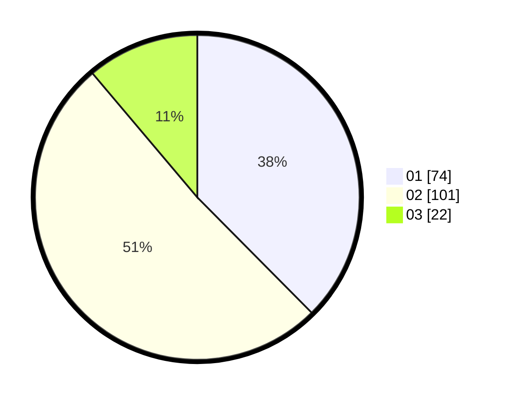

# Hasil

Hasil perolehan suara paslon dapat dilihat pada file paslon-01.txt, paslon-02.txt, dan paslon-03.txt.

Jika tidak ada, artinya data tersebut belum ada pada SIREKAP.

## Perolehan Suara

 * Paslon 01: **74**.
 * Paslon 02: **101**.
 * Paslon 03: **22**.

## Foto C Plano

https://sirekap-obj-formc.kpu.go.id/abd2/pemilu/ppwp/31/73/01/10/05/3173011005065-20240214-185652--0ba9a3c2-0cb5-42f3-9f2d-cdc6386dd049.jpg

https://sirekap-obj-formc.kpu.go.id/abd2/pemilu/ppwp/31/73/01/10/05/3173011005065-20240214-191544--36d7e883-e4ae-4625-a188-ba32ba9a5693.jpg

https://sirekap-obj-formc.kpu.go.id/abd2/pemilu/ppwp/31/73/01/10/05/3173011005065-20240214-192513--875adc90-08e8-41a8-a034-3b588be80c8c.jpg

## DATA PEMILIH TETAP

Jumlah pemilih dalam DPT: **205**.
 * L: **104**.
 * P: **101**.

## DATA PENGGUNA HAK PILIH

Jumlah pengguna hak pilih dalam DPT: **205**.
 * L: **104**.
 * P: **101**.

Jumlah pengguna hak pilih dalam DPTb: **0**.
 * L: **0**.
 * P: **0**.

Jumlah pengguna hak pilih dalam DPK: **0**.
 * L: **0**.
 * P: **0**.

Jumlah pengguna hak pilih: **205**.
 * L: **104**.
 * P: **101**.

## JUMLAH SUARA SAH DAN TIDAK SAH

JUMLAH SELURUH SUARA SAH: **197**.

JUMLAH SUARA TIDAK SAH: **8**.

JUMLAH SELURUH SUARA SAH DAN SUARA TIDAK SAH: **205**.
