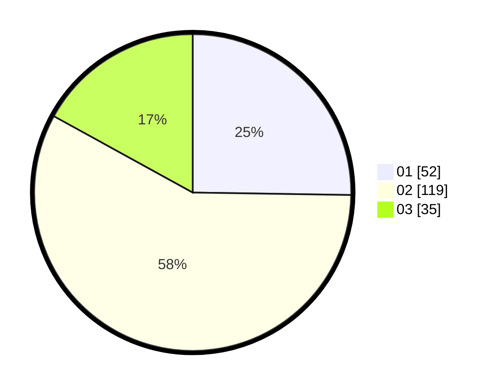

# Hasil

Hasil perolehan suara paslon dapat dilihat pada file paslon-01.txt, paslon-02.txt, dan paslon-03.txt.

Jika tidak ada, artinya data tersebut belum ada pada SIREKAP.

## Perolehan Suara

 * Paslon 01: **52**.
 * Paslon 02: **119**.
 * Paslon 03: **35**.

## Foto C Plano

https://sirekap-obj-formc.kpu.go.id/35ae/pemilu/ppwp/31/73/01/10/05/3173011005070-20240214-192522--f2fd9d5a-e92c-4382-8ac7-05044b309555.jpg

https://sirekap-obj-formc.kpu.go.id/35ae/pemilu/ppwp/31/73/01/10/05/3173011005070-20240214-235951--8c27a38e-5215-4998-aaa9-73d9fed0f968.jpg

https://sirekap-obj-formc.kpu.go.id/35ae/pemilu/ppwp/31/73/01/10/05/3173011005070-20240215-000233--aaa71f92-c6ae-4f86-9807-17cfc230733c.jpg

## DATA PEMILIH TETAP

Jumlah pemilih dalam DPT: **282**.
 * L: **142**.
 * P: **140**.

## DATA PENGGUNA HAK PILIH

Jumlah pengguna hak pilih dalam DPT: **209**.
 * L: **104**.
 * P: **105**.

Jumlah pengguna hak pilih dalam DPTb: **0**.
 * L: **0**.
 * P: **0**.

Jumlah pengguna hak pilih dalam DPK: **3**.
 * L: **2**.
 * P: **1**.

Jumlah pengguna hak pilih: **212**.
 * L: **105**.
 * P: **107**.

## JUMLAH SUARA SAH DAN TIDAK SAH

JUMLAH SELURUH SUARA SAH: **206**.

JUMLAH SUARA TIDAK SAH: **5**.

JUMLAH SELURUH SUARA SAH DAN SUARA TIDAK SAH: **211**.
