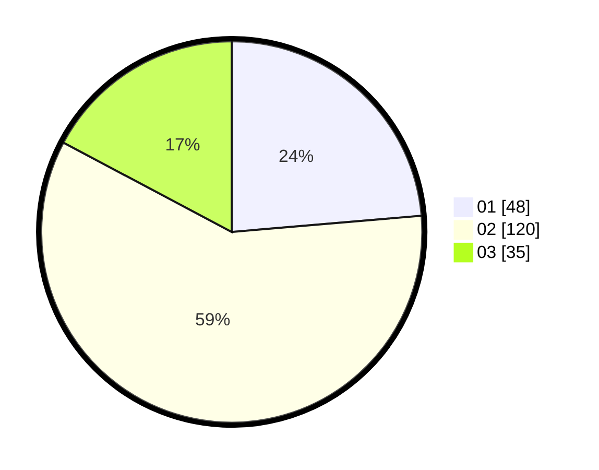

# Hasil

Hasil perolehan suara paslon dapat dilihat pada file paslon-01.txt, paslon-02.txt, dan paslon-03.txt.

Jika tidak ada, artinya data tersebut belum ada pada SIREKAP.

## Perolehan Suara

 * Paslon 01: **48**.
 * Paslon 02: **120**.
 * Paslon 03: **35**.

## Foto C Plano

https://sirekap-obj-formc.kpu.go.id/4030/pemilu/ppwp/31/73/01/10/05/3173011005071-20240215-222157--6a04e1e1-a499-4391-ae94-7bab5044b209.jpg

https://sirekap-obj-formc.kpu.go.id/4030/pemilu/ppwp/31/73/01/10/05/3173011005071-20240215-222201--30532ee8-39e8-42bf-a42c-1f0437a4dea1.jpg

https://sirekap-obj-formc.kpu.go.id/4030/pemilu/ppwp/31/73/01/10/05/3173011005071-20240215-222158--091e32db-0178-414a-b653-830585ab13dc.jpg

## DATA PEMILIH TETAP

Jumlah pemilih dalam DPT: **276**.
 * L: **136**.
 * P: **140**.

## DATA PENGGUNA HAK PILIH

Jumlah pengguna hak pilih dalam DPT: **206**.
 * L: **92**.
 * P: **114**.

Jumlah pengguna hak pilih dalam DPTb: **0**.
 * L: **0**.
 * P: **0**.

Jumlah pengguna hak pilih dalam DPK: **1**.
 * L: **0**.
 * P: **1**.

Jumlah pengguna hak pilih: **207**.
 * L: **92**.
 * P: **115**.

## JUMLAH SUARA SAH DAN TIDAK SAH

JUMLAH SELURUH SUARA SAH: **203**.

JUMLAH SUARA TIDAK SAH: **4**.

JUMLAH SELURUH SUARA SAH DAN SUARA TIDAK SAH: **207**.
