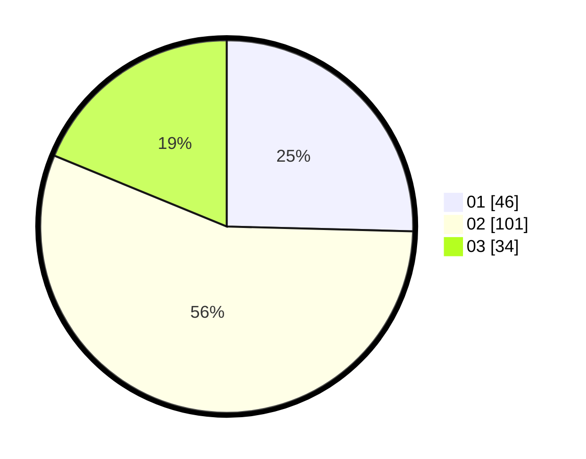

# Hasil

Hasil perolehan suara paslon dapat dilihat pada file paslon-01.txt, paslon-02.txt, dan paslon-03.txt.

Jika tidak ada, artinya data tersebut belum ada pada SIREKAP.

## Perolehan Suara

 * Paslon 01: **46**.
 * Paslon 02: **101**.
 * Paslon 03: **34**.

## Foto C Plano

https://sirekap-obj-formc.kpu.go.id/7eeb/pemilu/ppwp/31/73/01/10/05/3173011005075-20240214-225522--4ef3aaa9-4e82-4967-80cb-a248343b15da.jpg

https://sirekap-obj-formc.kpu.go.id/7eeb/pemilu/ppwp/31/73/01/10/05/3173011005075-20240214-203352--e6ccdfc9-dce5-422b-a864-79de790dc7f9.jpg

https://sirekap-obj-formc.kpu.go.id/7eeb/pemilu/ppwp/31/73/01/10/05/3173011005075-20240214-212223--8cd4be2d-1f14-4002-b111-dd19c99486ab.jpg
