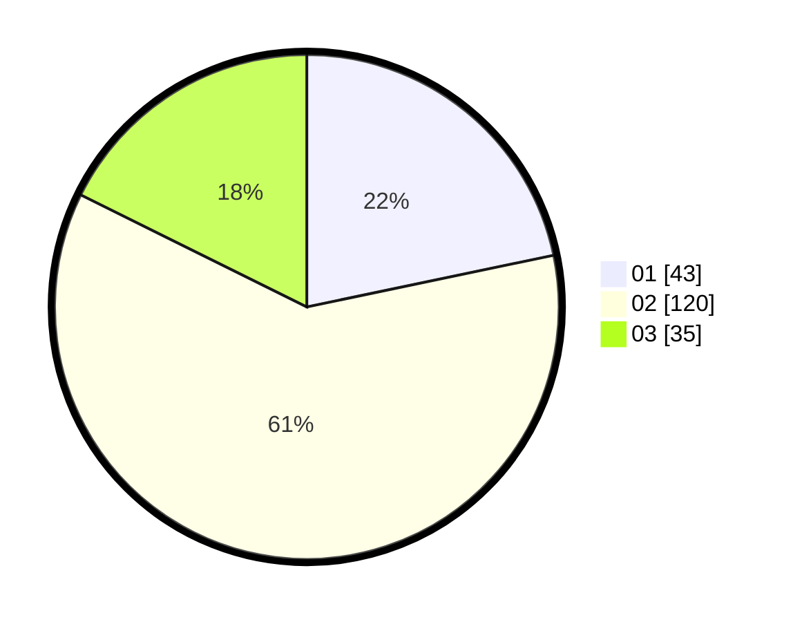

# Hasil

Hasil perolehan suara paslon dapat dilihat pada file paslon-01.txt, paslon-02.txt, dan paslon-03.txt.

Jika tidak ada, artinya data tersebut belum ada pada SIREKAP.

## Perolehan Suara

 * Paslon 01: **43**.
 * Paslon 02: **120**.
 * Paslon 03: **35**.

## Foto C Plano

https://sirekap-obj-formc.kpu.go.id/d250/pemilu/ppwp/31/73/01/10/05/3173011005076-20240214-220355--5505165e-b953-4e4a-8a52-c88558474ac3.jpg

https://sirekap-obj-formc.kpu.go.id/d250/pemilu/ppwp/31/73/01/10/05/3173011005076-20240214-220416--2db38f04-d5c0-42ca-9682-d3724cad2f4f.jpg

https://sirekap-obj-formc.kpu.go.id/d250/pemilu/ppwp/31/73/01/10/05/3173011005076-20240214-220405--200e9879-ac45-4b9b-bdb6-6cce618de5b7.jpg

## DATA PEMILIH TETAP

Jumlah pemilih dalam DPT: **293**.
 * L: **152**.
 * P: **141**.

## DATA PENGGUNA HAK PILIH

Jumlah pengguna hak pilih dalam DPT: **201**.
 * L: **110**.
 * P: **91**.

Jumlah pengguna hak pilih dalam DPTb: **0**.
 * L: **0**.
 * P: **0**.

Jumlah pengguna hak pilih dalam DPK: **1**.
 * L: **0**.
 * P: **1**.

Jumlah pengguna hak pilih: **202**.
 * L: **110**.
 * P: **92**.

## JUMLAH SUARA SAH DAN TIDAK SAH

JUMLAH SELURUH SUARA SAH: **198**.

JUMLAH SUARA TIDAK SAH: **4**.

JUMLAH SELURUH SUARA SAH DAN SUARA TIDAK SAH: **202**.
