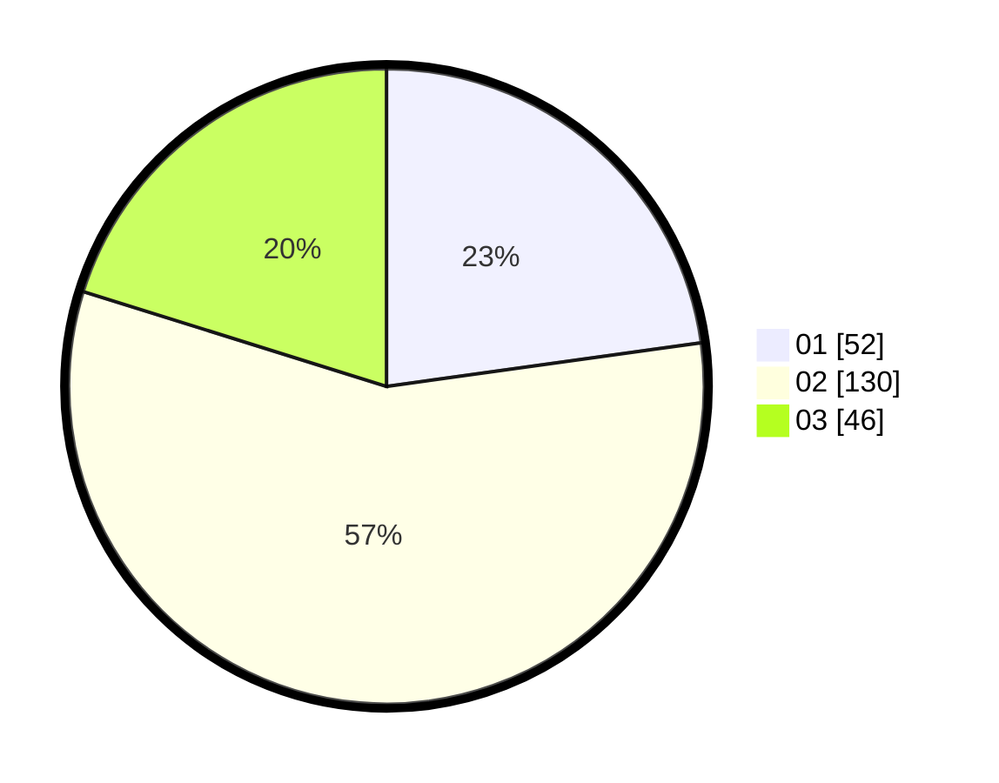

# Hasil

Hasil perolehan suara paslon dapat dilihat pada file paslon-01.txt, paslon-02.txt, dan paslon-03.txt.

Jika tidak ada, artinya data tersebut belum ada pada SIREKAP.

## Perolehan Suara

 * Paslon 01: **52**.
 * Paslon 02: **130**.
 * Paslon 03: **46**.

## Foto C Plano

https://sirekap-obj-formc.kpu.go.id/6b1e/pemilu/ppwp/31/73/01/10/05/3173011005081-20240214-230227--61a4be6f-43aa-44a5-9f63-1a5bf8f286f9.jpg

https://sirekap-obj-formc.kpu.go.id/6b1e/pemilu/ppwp/31/73/01/10/05/3173011005081-20240214-230352--2bc5aa78-9d43-4a8b-93ca-82e509b54548.jpg

https://sirekap-obj-formc.kpu.go.id/6b1e/pemilu/ppwp/31/73/01/10/05/3173011005081-20240214-230518--c5814e91-4953-407a-b098-bf483fc3e5b3.jpg

## DATA PEMILIH TETAP

Jumlah pemilih dalam DPT: **74**.
 * L: **151**.
 * P: **177**.

## DATA PENGGUNA HAK PILIH

Jumlah pengguna hak pilih dalam DPT: **270**.
 * L: **117**.
 * P: **117**.

Jumlah pengguna hak pilih dalam DPTb: **0**.
 * L: **0**.
 * P: **0**.

Jumlah pengguna hak pilih dalam DPK: **0**.
 * L: **0**.
 * P: **0**.

Jumlah pengguna hak pilih: **230**.
 * L: **118**.
 * P: **112**.

## JUMLAH SUARA SAH DAN TIDAK SAH

JUMLAH SELURUH SUARA SAH: **128**.

JUMLAH SUARA TIDAK SAH: **2**.

JUMLAH SELURUH SUARA SAH DAN SUARA TIDAK SAH: **130**.
