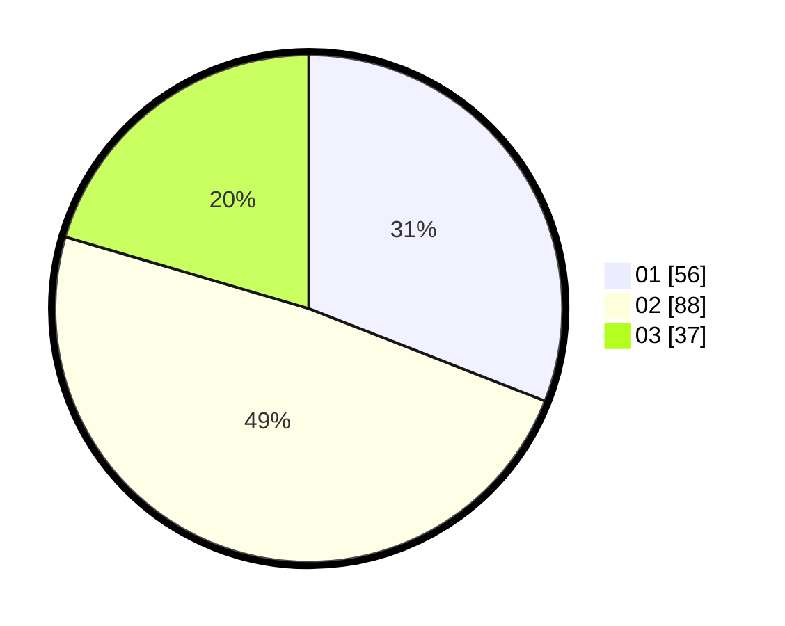

# Hasil

Hasil perolehan suara paslon dapat dilihat pada file paslon-01.txt, paslon-02.txt, dan paslon-03.txt.

Jika tidak ada, artinya data tersebut belum ada pada SIREKAP.

## Perolehan Suara

 * Paslon 01: **56**.
 * Paslon 02: **88**.
 * Paslon 03: **37**.

## Foto C Plano

https://sirekap-obj-formc.kpu.go.id/80f2/pemilu/ppwp/31/73/01/10/05/3173011005083-20240216-144036--1755fff6-4ac0-4c35-8fc4-b5395528a408.jpg

https://sirekap-obj-formc.kpu.go.id/80f2/pemilu/ppwp/31/73/01/10/05/3173011005083-20240216-144038--c2b0a3f3-406d-4cf1-b84b-7be0b2ab015f.jpg

https://sirekap-obj-formc.kpu.go.id/80f2/pemilu/ppwp/31/73/01/10/05/3173011005083-20240216-144037--37f9920e-9df0-40a7-bf04-39b3755fd5f1.jpg

## DATA PEMILIH TETAP

Jumlah pemilih dalam DPT: **282**.
 * L: **151**.
 * P: **131**.

## DATA PENGGUNA HAK PILIH

Jumlah pengguna hak pilih dalam DPT: **282**.
 * L: **151**.
 * P: **131**.

Jumlah pengguna hak pilih dalam DPTb: **0**.
 * L: **0**.
 * P: **0**.

Jumlah pengguna hak pilih dalam DPK: **0**.
 * L: **0**.
 * P: **0**.

Jumlah pengguna hak pilih: **282**.
 * L: **151**.
 * P: **131**.

## JUMLAH SUARA SAH DAN TIDAK SAH

JUMLAH SELURUH SUARA SAH: **181**.

JUMLAH SUARA TIDAK SAH: **2**.

JUMLAH SELURUH SUARA SAH DAN SUARA TIDAK SAH: **37**.
