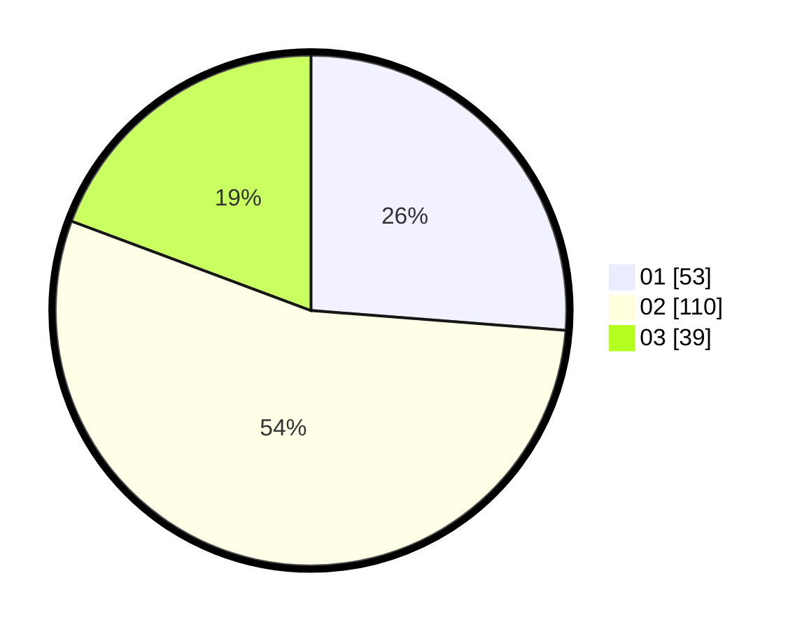

# Hasil

Hasil perolehan suara paslon dapat dilihat pada file paslon-01.txt, paslon-02.txt, dan paslon-03.txt.

Jika tidak ada, artinya data tersebut belum ada pada SIREKAP.

## Perolehan Suara

 * Paslon 01: **53**.
 * Paslon 02: **110**.
 * Paslon 03: **39**.

## Foto C Plano

https://sirekap-obj-formc.kpu.go.id/a47f/pemilu/ppwp/31/73/01/10/05/3173011005087-20240214-195015--e0b3bff2-0459-4cb6-91db-295b6d209c7f.jpg

https://sirekap-obj-formc.kpu.go.id/a47f/pemilu/ppwp/31/73/01/10/05/3173011005087-20240214-195315--0eb0f5b1-f200-4d38-a185-b8678f430ce8.jpg

https://sirekap-obj-formc.kpu.go.id/a47f/pemilu/ppwp/31/73/01/10/05/3173011005087-20240214-195519--995abed4-71a7-437e-b75c-d635b222329c.jpg
