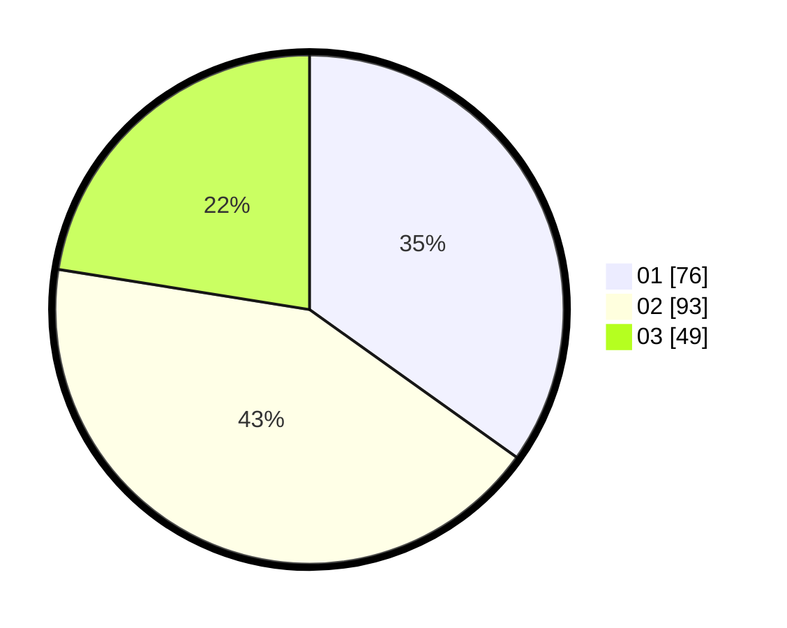

# Hasil

Hasil perolehan suara paslon dapat dilihat pada file paslon-01.txt, paslon-02.txt, dan paslon-03.txt.

Jika tidak ada, artinya data tersebut belum ada pada SIREKAP.

## Perolehan Suara

 * Paslon 01: **76**.
 * Paslon 02: **93**.
 * Paslon 03: **49**.

## Foto C Plano

https://sirekap-obj-formc.kpu.go.id/b50e/pemilu/ppwp/31/73/01/10/05/3173011005089-20240214-204352--aa4ca6fc-1b60-4f51-b3d2-11c36fc9c3ed.jpg

https://sirekap-obj-formc.kpu.go.id/b50e/pemilu/ppwp/31/73/01/10/05/3173011005089-20240214-204524--ba6d5fac-cbdb-416f-bfde-f2c94cd26699.jpg

https://sirekap-obj-formc.kpu.go.id/b50e/pemilu/ppwp/31/73/01/10/05/3173011005089-20240214-204614--9555b795-cb89-423a-b6b0-97eee0fb10b4.jpg
